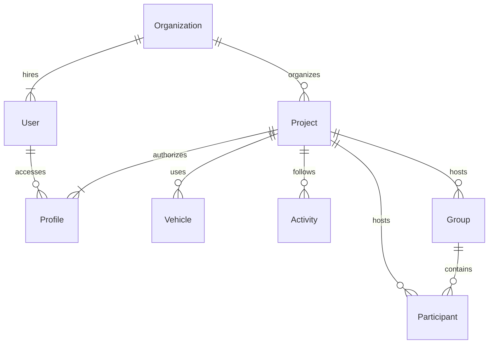

# Business Objects - Core

This section describes the core entities managed by the application (core module) and their relationships.

## Entities

- [Organization](/functional/business-objects/core/organization)
	- [User](/functional/business-objects/core/user)
		- [Profile](/functional/business-objects/core/profile)
	- [Project](/functional/business-objects/core/project)
		- [Profile](/functional/business-objects/core/profile)
		- [Group](/functional/business-objects/core/group)
			- [Participant](/functional/business-objects/core/participant)
		- [Participant](/functional/business-objects/core/participant)
		- [Activity](/functional/business-objects/core/activity)
		- [Vehicle](/functional/business-objects/core/vehicle)

## Structure

