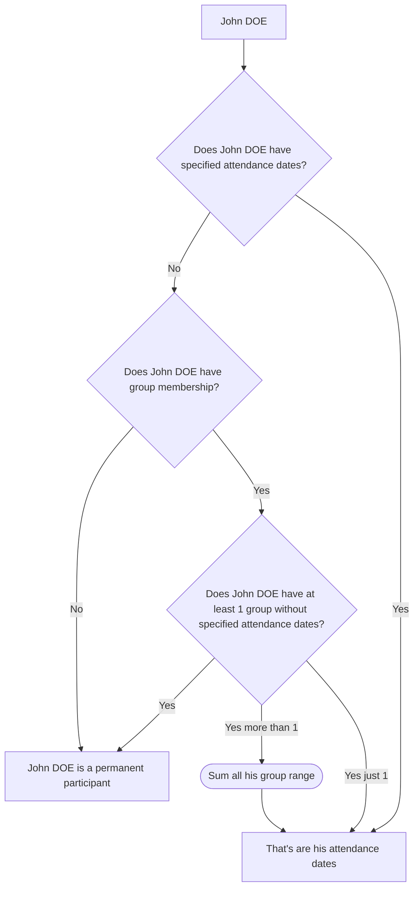

# Participant

## Definition

A **Participant** is a person registered in a project. Participants are the primary subjects of the
application: their presence, movements, and registrations are tracked.

```
Organization
└── Project
    ├── Group
    │   └── Participant
    └── Participant
```

::: info Participant relation to group
A participant is part of a project and can (if the GROUP option is enabled) be added to a group. Groups are a grouping mechanism, not a hierarchical parent.
:::

::: warning Participant ≠ User
A participant is not the same as an application user. A user is a person who logs into the app. A participant is a
person who takes part in a project. The two can optionally be linked, but they remain distinct concepts. Linking a
participant to a user is never mandatory.
:::

## Main attributes

| Attribute        | Description                                                                                                                                  |
| ---------------- | -------------------------------------------------------------------------------------------------------------------------------------------- |
| Lastname         | The participant lastname                                                                                                                     |
| Firstname        | The participant firstname                                                                                                                    |
| Birthday         | The participant date of birth                                                                                                                |
| Type             | Registered OR Guest (scheduled or created in a movement)                                                                                     |
| Attendance dates | Date and time range to identify participant start and end project participation (if not set: participate for whole project or groups period) |
| User             | Optional link a user                                                                                                                         |

### Minor VS Major

A participant is classified as a minor or major based solely on their **birthdate**, compared against **today's date**.
This classification is re-evaluated dynamically — a participant can become a major during the course of a project.

### Type

There are 2 types:

- REGISTERED
- GUEST

A **Guest** (`type = GUEST`) is a lightweight variant of a participant. Unlike a registered participant
(`type = REGISTERED`), a guest is not pre-registered in the project — they are created at the time of a movement.
Guests share the same table as registered participants but are distinguished by their type and carry no project history
outside of the movement they were created for.

#### Guest lifecycle

A guest's lifecycle is strictly limited to **two movements**:

1. An `IN` movement — the guest enters the site.
2. An `OUT` movement — the guest leaves the site.

No further movements can be recorded for a guest after they have gone out.

### Status

A participant does not have an explicit status field. Its state is derived from:

| Situation                                                                                         | Implied state     |
| ------------------------------------------------------------------------------------------------- | ----------------- |
| Has been soft deleted                                                                             | `DISABLED`        |
| Arrival date is in the future                                                                     | `NOT_HERE`        |
| End date is in the past                                                                           | `NO_MORE_HERE`    |
| Refer to [movement](/functional/business-objects/operations/movement#participant-presence-status) |                   |
| No dates set OR today is between start and end dates                                              | `NOT_ARRIVED_YET` |

### Attendance dates

A participant can have their own attendance dates (arrival and departure). These are optional.

How to read participant presence:



::: warning Particular group logic
A participant without attendance dates nor group is considered as permanent.
VS
A participant without attendance dates but with a group depend or the group date.
:::

## Action

### Read & Search

- Allowed roles:
  - `PROJECT_ADMIN`
  - `PROJECT_MANAGER`
  - `PROJECT_USER`
- Constraints:
  - Search are allowed on following field but not required:
    - Text search on firstname, lastname
    - Is minor depending birthday
    - Type equal at least one given types
    - Available dates includes a date
    - Status equal at least one given statuses

### Creation

- Allowed roles:
  - `PROJECT_ADMIN`
  - `PROJECT_MANAGER`
  - `PROJECT_USER` -> Only for `GUEST` participant
- Constraints:
  - Lastname is required
  - Firstname is required
  - Birthday is required
  - Type is automatically set depending on context (participants created outside of a movement are `REGISTERED`)
  - Attendance dates are optional
  - User is optional

### Edition

- Allowed roles:
  - `PROJECT_ADMIN`
  - `PROJECT_MANAGER`
- Constraints (differences with creation):
  - Type cannot be changed

### Soft-delete

- Allowed roles:
  - `PROJECT_ADMIN`
  - `PROJECT_MANAGER`
- Constraints:
  - The soft-deletion should not impact module [operations](/functional/business-objects/operations).
  - `PROJECT_ADMIN`s still see the participant but it should be marked “disabled” (refer to [status](#status)).

### Enable-back

- Allowed roles:
  - `PROJECT_ADMIN`
- Constraints:
  - Only applicable to soft-deleted participants

### Purge (GDPR)

Purge condition: The participant has had no related operation in the last year.

- Allowed roles:
  - `PROJECT_ADMIN`
  - Any user linked to the concerned participant
- Constraints:
  - The deletion MUST affect the [operations](/functional/business-objects/operations) module.
  - The deletion cannot be rolled back

### Data extraction (GDPR)

- Allowed roles:
  - `PROJECT_ADMIN`
  - `PROJECT_MANAGER`
  - Any user linked to the concerned participant
- Constraints:
  - Should not include other participant personal data

Refer [data policy](/functional/data-policy) to see expected format and data in the export.

### Delete

::: info Delete ≠ Soft-Delete ≠ Purge
Delete is a permanent removal from the database and ignores the purge conditions.
:::

- Allowed roles:
  - `PROJECT_ADMIN`
- Constraints:
  - A participant must not have any related [operations](/functional/business-objects/operations) to be deleted.
  - The deletion cannot be rolled back

::: tip Participant created by mistake
If you created a participant by mistake, or they ended up not attending but were already included in a movement, you cannot delete them. Instead, you can soft-delete them or set a departure date in the past or present to indicate their absence.
:::

## Relationships

| Related object | Relationship                                                |
| -------------- | ----------------------------------------------------------- |
| Project        | A participant belongs to one project                        |
| Group          | A participant can belong to zero or more groups             |
| Movement       | A participant can be included in zero or more movements     |
| User           | A participant can be linked to zero or one application user |
