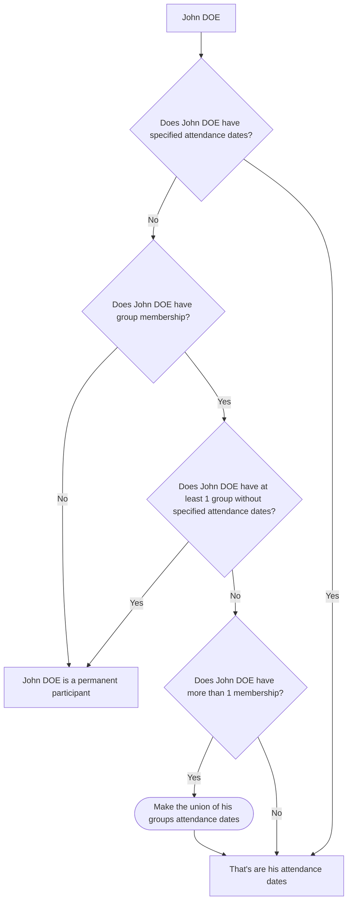

# Participant

## Definition

A **Participant** is a person registered in a project. Participants are the primary subjects of the
application: their presence, movements, and registrations are tracked.

```
Organization
└── Project
    ├── Group
    │   └── Participant
    └── Participant
```

::: info Participant relation to group
A participant is part of a project and can (if the GROUP option is enabled) be added to a group. Groups are a grouping mechanism, not a hierarchical parent.
:::

::: warning Participant ≠ User
A participant is not the same as an application user. A user is a person who logs into the app. A participant is a
person who takes part in a project. The two can optionally be linked, but they remain distinct concepts. Linking a
participant to a user is never mandatory.
:::

## Main attributes

| Attribute        | Description                                                                                                                                  |
|------------------|----------------------------------------------------------------------------------------------------------------------------------------------|
| Lastname         | The participant lastname                                                                                                                     |
| Firstname        | The participant firstname                                                                                                                    |
| Birthday         | The participant date of birth                                                                                                                |
| Type             | Registered OR Guest (scheduled or created in a movement)                                                                                     |
| Attendance dates | Date and time range defining when the participant attends the project (if not set: participates for the whole project or groups period)       |
| User             | Optional link to a user                                                                                                                      |

### Minor VS Major

A participant is classified as a minor or major based solely on their **birthdate**, compared against **today’s date**.
This classification is re-evaluated dynamically — a participant can become a major during the course of a project.

### Type

There are 2 types:

- REGISTERED
- GUEST

A **Guest** (`type = GUEST`) is a lightweight variant of a participant. Unlike a registered participant
(`type = REGISTERED`), a guest is not pre-registered in the project — they are created at the time of a movement.
Guests share the same table as registered participants but are distinguished by their type and carry no project history
outside of the movement they were created for.

#### Guest lifecycle

A guest’s lifecycle is strictly limited to **two movements**:

1. An `IN` movement — the guest enters the site.
2. An `OUT` movement — the guest leaves the site.

No further movements can be recorded for a guest after they have gone out.

### Status

A participant does not have an explicit status field. Its state is derived from:

| Situation                                            | Implied state       |
|------------------------------------------------------|---------------------|
| Has been soft deleted                                | `DISABLED`          |
| Arrival date is in the future                        | `NOT_AVAILABLE_YET` |
| End date is in the past                              | `NO_MORE_AVAILABLE` |
| No dates set OR today is between start and end dates | `ACTIVE`            |

For the runtime **presence** status (derived from movement history: `IN`, `OUT`, `NO_MORE_HERE`), see [Movement — Participant presence status](/functional/business-objects/operations/movement#participant-presence-status). The two statuses are independent: the table above is computed from the participant's attendance dates, while the presence status is computed from their movement history.

### Attendance dates

A participant can have their own attendance dates (arrival and departure). These are optional.

How to read participant presence:


```mermaid
flowchart TD
    P[John DOE] --> PHD{Does John DOE have specified attendance dates?}
    PHD -->|Yes| PD["That's are his attendance dates"]
    PHD -->|No| PHG{Does John DOE have group membership?}
    PHG -->|Yes| GWD{Does John DOE have at least 1 group without specified attendance dates?}
    GWD -->|Yes| PAT[John DOE is a permanent participant]
    PHG -->|No| PAT
    GWD -->|No| GHD{Does John DOE have more than 1 membership?}
    GHD -->|No| PD
    GHD -->|Yes| PHM1G([Make the union of his groups attendance dates])
    PHM1G --> PD
```

::: warning Particular group logic
A participant without attendance dates and without any group is considered permanent. A participant without attendance dates but with at least one group depends on the group's dates.
:::

## Relationships

| Related object    | Relationship                                                                       |
|-------------------|------------------------------------------------------------------------------------|
| Project           | A participant belongs to one project                                               |
| Group             | A participant can belong to zero or more groups                                    |
| Movement          | A participant can be included in zero or more movements                            |
| User              | A participant can be linked to zero or one application user                        |
| Comment           | A participant can receive zero or more comments                                    |
| Completion Notice | A participant can have zero or one Internal notice and zero or one External notice |
