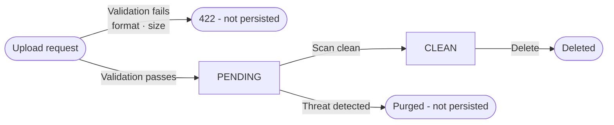

# Document

## Definition

A **Document** is a stored file managed exclusively by the document module. The module carries no business logic and
has no knowledge of the entities that use its documents. It acts as a document box: it receives files, verifies them, stores them, and returns IDs. The relationship between a document and a business entity is the responsibility of the consuming module, which stores the document ID in its own record.

::: warning Module transversal
The document module is cross-cutting. Any module that needs to attach files to its objects stores document IDs in its own data model. The document module itself never holds a reference to a participant, project, or organization.
:::

> E.g. a participant can have an identity document, a medical certificate, and an authorization form attached to their profile. The participant module stores the document IDs of these files in the participant record, but the document module itself is agnostic of this relationship.
> ```mermaid
> flowchart LR
> D["Document\n(id, name, type, status, ...)"]
> P["<a href='/functional/business-objects/core/participant'>Participant</a>\ndocument_ids[]"]
> PR["<a href='/functional/business-objects/core/project'>Project</a>\ndocument_ids[]"]
> O["<a href='/functional/business-objects/core/organization'>Organization</a>\ndocument_ids[]"]
> P -- stores ID --> D
> PR -- stores ID --> D
> O -- stores ID --> D
> ```

## Main attributes

| Attribute   | Description                                                                        |
|-------------|------------------------------------------------------------------------------------|
| Name        | Original filename as provided by the uploader                                      |
| Type        | Document type, drawn from the configurable type list of the organization           |
| MIME type   | Detected MIME type of the file (verified server-side, not trusted from the client) |
| Size        | File size in bytes                                                                 |
| Status      | Current scan status of the document (see below)                                    |
| Uploaded by | Reference to the user who performed the upload                                     |
| Uploaded at | Timestamp of the upload                                                            |

### Status

Only documents that pass all upload validations are persisted. A document therefore only ever exists in one of two states:

| Status    | Description                                                |
|-----------|------------------------------------------------------------|
| `PENDING` | File stored; antivirus scan has not yet completed          |
| `CLEAN`   | Antivirus scan passed; document is accessible for download |

::: info Validation failures and infected files are never persisted
If the file fails pre-upload validation (unsupported format, size exceeded), the upload is rejected immediately with a
`422` and no record is created. If the antivirus scan detects a threat, the file and its record are purged immediately — the document never transitions to a persisted error state.
:::

::: warning Consuming module responsibility on 404
Because infected documents are purged, a consuming module may encounter a
`404` when attempting to download a document whose ID it has stored. This signals that the file was infected and removed. The consuming module should handle this case by transitioning its own business status accordingly (e.g.
`REJECTED`).
:::

### Lifecycle



## Document types

Document types are configurable per organization. They allow categorizing documents attached to entities (e.g. identity document, medical certificate, authorization form). The list of available types is managed at the organization level and applies to all projects within that organization.

## Allowed formats

| Format | MIME types                |
|--------|---------------------------|
| PDF    | `application/pdf`         |
| Image  | `image/jpeg`, `image/png` |
| TIFF   | `image/tiff`              |

Maximum file size: **5 MB**.

## Validation rules

The following rules are enforced synchronously at upload time, before the file is persisted:

| Rule            | On failure                      |
|-----------------|---------------------------------|
| MIME type check | `422` returned, file not stored |
| Size limit      | `422` returned, file not stored |

## Relationships

The document module holds no reference to the entities that consume its documents. The only internal relationship is with the user who performed the upload, for audit purposes.

| Related object | Relationship                                        |
|----------------|-----------------------------------------------------|
| User           | A document records the user who uploaded it (audit) |
