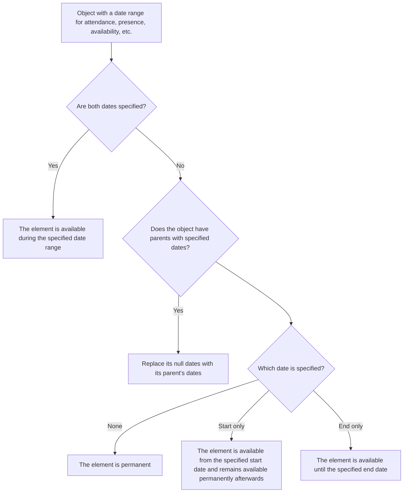

# Business Objects

Business objects are split into five categories:

- [Core](/functional/business-objects/core/) objects, which are the fundamental entities of the application and are not tied to any specific feature;
- [Operations](/functional/business-objects/operations/) objects, each gated by its own per-entity option (`MOVEMENT`, `ALERT`, `COMMENT`, `COMPLETION_NOTICE`);
- [Preparation](/functional/business-objects/preparation/) objects, which are linked to the preparation feature and may be unavailable if the
  `PREPARATION` option is disabled on the project;
- [Registration](/functional/business-objects/registration/) objects, which are linked to the registration feature and may be unavailable if the
  `REGISTRATION` option is disabled on the project.

> [Document](/functional/business-objects/document/) is a special module, which only concerns document management and does not contain any business rules.

## Main attributes

All objects have a “Main attributes” section. This section covers functionally relevant fields but is not an exhaustive list. For the full attribute list, refer to the [technical documentation](/technical/).

## Dates range

The specified dates range is in reality a zoned datetime range. However, for simplicity, only the date part is displayed in the documentation. A date can be defined without the specified time, in that case, the time part is set:

- to 00:00:00 for the start date
- to 23:59:59 for the end date.

> Note: the time zone used is the project's own time zone.

### Reading

Many objects have a date range defined by a start and end date. This range indicates when the object is active, available, or relevant.
This date range is read as follows:

### Usage

The following module is dedicated to configuration and management of the business objects:

- [Core](/functional/business-objects/core/) for the main entities (organizations, projects, groups, participants, etc.)
- [Preparation](/functional/business-objects/preparation/) for the preparation planning (location, typical day, planning, pedagogy, menu, budget)
- [Registration](/functional/business-objects/registration/) for the registration process and management
- [Document](/functional/business-objects/document/) for documents and their management

Date ranges are visible and can be configured but have no impact on the previous modules.

The real impact of dates ranges is on the [Operations](/functional/business-objects/operations/) module, which contains entities related to movements, alerts, communications, and comments.
The possibility to include these entities in a movement is determined by their date ranges and the rules described above.

> E.g. if an activity is defined with a date range from 01/01/2024 to 31/01/2024, it can only be included in movements that occur between these dates. If a movement is created on 15/01/2024, the activity will be available for selection. However, if a movement is created on 01/02/2024, the activity will not be available for selection.

::: warning Profile exception
Profile is a bit different as it is not an entity but a set of permissions. However, it defines the access period.
A user with a profile that has an end date in the past is considered expired and cannot consult or interact with the project concerned by the expired profile.
:::

## Statuses

Some entities have a status field defined as a priority list. The first status that matches the object's state is applied.

> E.g. if a participant matches the conditions at both line 1 and line 3 of the status table, their displayed status is the one at line 1.
