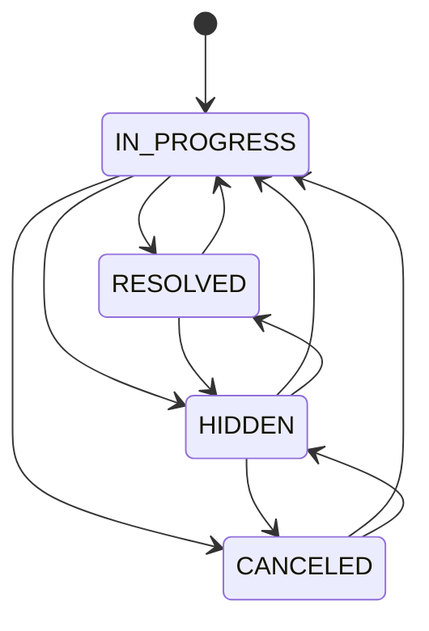

# Alert

::: info Option required
Alerts are only available if the **ALERT** option is enabled on the project.
:::

## Definition

An **Alert** is a structured container that groups a status, a topic, and a communication thread. It is used to track
and discuss any situation that requires formal follow-up.

```
Project
└── Alert
```

::: info Editability
Alert supports in-place editing of `title`, `description`, and `status` via [Edit alert](/functional/features/edit-alert). See the [Editability policy](/functional/business-objects/operations/#editability-of-operations-entities).
:::

## Main attributes

| Attribute      | Description            |
|----------------|------------------------|
| Title          | Summary of the purpose |
| Description    | Alert description      |
| Status         | Alert status           |
| Communications | Communication thread   |

### Status

| Status        | Description                                    |
|---------------|------------------------------------------------|
| `IN_PROGRESS` | The alert is open and being actively monitored |
| `RESOLVED`    | The situation has been resolved                |
| `CANCELED`    | The alert has been closed without resolution   |
| `HIDDEN`      | The alert has been soft-deleted                |

#### Transitions

Status transitions are free, with one exception: `RESOLVED` and `CANCELED` cannot transition into each other directly (to move from one to the other, an admin must re-open the alert to `IN_PROGRESS` first).



### Communications

See [Communication](/functional/business-objects/operations/communication).

## Relationships

| Related object | Relationship                                 |
|----------------|----------------------------------------------|
| Communication  | An alert contains one or more communications |
| Project        | An alert belongs to one project              |
