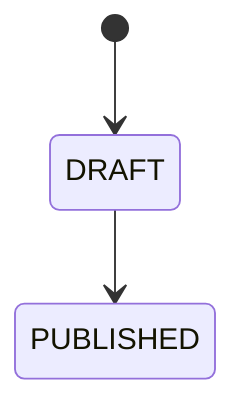

# Completion Notice

::: info Option required
Completion Notices are only available if the **COMPLETION_NOTICE** option is enabled on the project.
:::

## Definition

A **Completion Notice** is a formal document attached to a participant at the end of a project. It
summarizes the project outcome from that participant's perspective. A participant can have at most one notice of
each type: one **Internal** and one **External**.

```
Project
└── Participant
    └── Completion Notice
```

| Type       | Audience                                                                 |
|------------|--------------------------------------------------------------------------|
| `INTERNAL` | Intended for the organization's internal stakeholders                    |
| `EXTERNAL` | Intended for external recipients (parents, partners, supervisory bodies) |

::: info Zero or one per type per participant
A participant can have zero or one Internal notice and zero or one External notice. The two are independent and
can be created separately.
:::

## Main attributes

| Attribute | Description              |
|-----------|--------------------------|
| Type      | `INTERNAL` or `EXTERNAL` |
| Content   | The body of the notice   |
| Status    | Publication status       |

### Status

| Status      | Description                             |
|-------------|-----------------------------------------|
| `DRAFT`     | Being written, not yet published        |
| `PUBLISHED` | Finalized and distributed to recipients |

#### Transitions



- A notice is created in `DRAFT`.
- A notice can be edited freely while in `DRAFT`.
- Publishing transitions it to `PUBLISHED`. **The transition is irreversible**: a published notice cannot be reverted to `DRAFT`, and its content is frozen from that point on.
- See [Create](/functional/features/create-completion-notice), [Edit](/functional/features/edit-completion-notice), and [Publish](/functional/features/publish-completion-notice) for the feature-level constraints and roles.

::: info Editability
A Completion Notice can be edited in place only while in `DRAFT`. Once `PUBLISHED`, it becomes immutable. See the [Editability policy](/functional/business-objects/operations/#editability-of-operations-entities).
:::

## Relationships

| Related object | Relationship                                         |
|----------------|------------------------------------------------------|
| Participant    | A notice belongs to one participant                  |
| Project        | A notice is scoped to the project of its participant |
