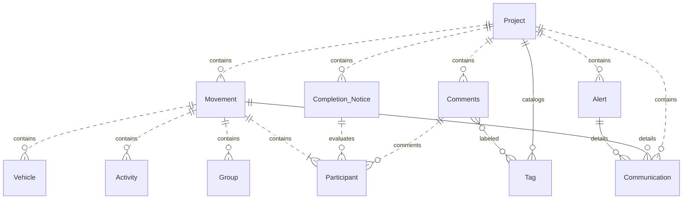

# Business Objects - Operations

This section describes the operations entities managed by the application and their relationships.

## Entities

To illustrate which **Project** it belongs to, the project appears in the diagram, but it is actually the one from
the core module.

- [Project](/functional/business-objects/core/project)
	- [Movement](/functional/business-objects/operations/movement)
		- [Communication](/functional/business-objects/operations/communication) *(movement with activity only)*
	- [Alert](/functional/business-objects/operations/alert)
		- [Communication](/functional/business-objects/operations/communication)
	- [Participant](/functional/business-objects/core/participant)
		- [Comment](/functional/business-objects/operations/comment)
			- [Tag](/functional/business-objects/operations/tag) *(project-scoped catalog)*
		- [Completion Notice](/functional/business-objects/operations/completion-notice) *(0..1 Internal, 0..1
		  External)*

## Structure

> Dot relationships (
`..`) are used to indicate that related entities are from another module, while solid relationships (
`--`) indicate entities from the same module.
> All elements are scoped to a project, but for readability we only show the project relationship on top-level entities (movement, alert, etc.).

## Editability of Operations entities

**Movement is the only immutable entity** in the Operations module. Every other entity supports in-place editing.

| Entity                                                                         | Editability                                                                                                                                                                                                                                                |
|--------------------------------------------------------------------------------|------------------------------------------------------------------------------------------------------------------------------------------------------------------------------------------------------------------------------------------------------------|
| [Movement](/functional/business-objects/operations/movement)                   | **Immutable**. No edit feature. To correct, soft-delete with [Hide movement](/functional/features/hide-movement) and record a new one.                                                                                                                     |
| [Communication](/functional/business-objects/operations/communication)         | **In-place edit** of the `message` ([Edit communication](/functional/features/edit-communication)).                                                                                                                                                        |
| [Alert](/functional/business-objects/operations/alert)                         | **In-place edit** of `title`, `description`, and `status` ([Edit alert](/functional/features/edit-alert)).                                                                                                                                                 |
| [Comment](/functional/business-objects/operations/comment)                     | **In-place edit** of message and tags ([Edit comment](/functional/features/edit-comment)). Delete with [Delete comment](/functional/features/delete-comment).                                                                                              |
| [Completion Notice](/functional/business-objects/operations/completion-notice) | **Editable in `DRAFT`** only. Once `PUBLISHED`, the notice becomes immutable. See [Create](/functional/features/create-completion-notice), [Edit](/functional/features/edit-completion-notice), [Publish](/functional/features/publish-completion-notice). |

::: info Why Movement is special
The Movement log is the audit trail of entries and exits at the site. It must reflect what actually happened, so edits after the fact are forbidden — corrections go through a soft-delete of the erroneous movement and a new one. All other Operations entities are working annotations on top of that log and can be edited in place.
:::
