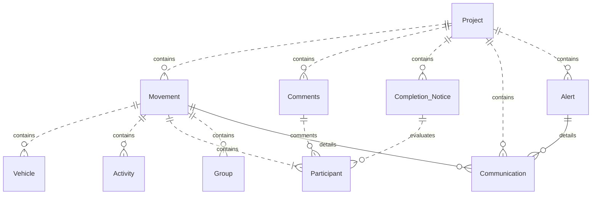

# Business Objects - Operations

This section describes the operations entities managed by the application and their relationships.

## Entities

To illustrate which **Project** it belongs to, the project appears in the diagram, but it is actually the one from
the core module.

- [Project](/functional/business-objects/core/project)
	- [Movement](/functional/business-objects/operations/movement)
		- [Communication](/functional/business-objects/operations/communication) *(movement with activity only)*
	- [Alert](/functional/business-objects/operations/alert)
		- [Communication](/functional/business-objects/operations/communication)
	- [Participant](/functional/business-objects/core/participant)
		- [Comment](/functional/business-objects/operations/comment)
		- [Completion Notice](/functional/business-objects/operations/completion-notice) *(0:1 Internal, 0:1 External)*

## Structure

> Dot relationships (`..`) are used to indicate related entities is from another module, while solid relationships (
`--`) indicate entities from the same module.
> All element are scoped to a project, but for readability we only show the project relationship on top-level entities (movement, alert, etc.).
