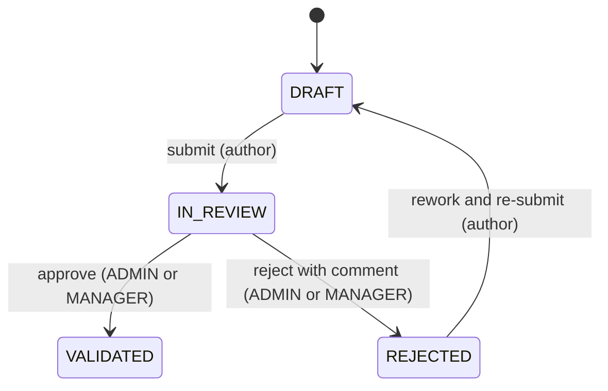
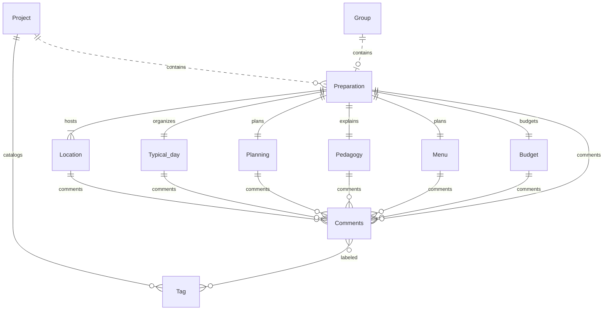

::: danger DO NOT IMPLEMENT
This part needs refinement to clarify the exact scope and content of the preparation business object. The current structure is a preliminary draft and may evolve significantly as we further define the requirements and use cases for the preparation module.
:::

# Preparation

::: info Option required
Preparations are only available if the **PREPARATION** option is enabled on the project.
:::

## Definition

A **Preparation** is a planning container that groups all the organizational elements required before a project
starts. It can be attached to a project or to a group, but not to both simultaneously.

```
Organization
└── Project
    ├── Preparation
    └── Group
        └── Preparation
```

A preparation can be attached to either a project (the typical case) or a group — not both at the same time. A group always belongs to a project, so a group-level preparation is indirectly tied to a project through the group hierarchy.

> E.g. In the case of a supervised camp, participating groups may, for example, receive preparation based on their own schedule.

::: info One preparation at a time
A project can have at most one project-level preparation. A group can have at most one group-level preparation. A single preparation instance cannot be simultaneously attached to both a project and a group. A project can therefore end up linked to several preparations in total: its own (zero or one) plus one per group (zero or one per group).
:::

## Main attributes

| Attribute | Description                                 |
|-----------|---------------------------------------------|
| Status    | Validation status of the preparation        |
| Comments  | Discussion thread on the preparation itself |

### Status

| Status      | Description                                       |
|-------------|---------------------------------------------------|
| `DRAFT`     | Preparation is being edited, not yet submitted    |
| `IN_REVIEW` | Preparation has been submitted for validation     |
| `VALIDATED` | Preparation has been approved                     |
| `REJECTED`  | Preparation has been rejected and requires rework |

#### Transitions



Ownership of the transitions:

| Transition              | Role                                                                                  |
|-------------------------|---------------------------------------------------------------------------------------|
| `DRAFT → IN_REVIEW`     | Author of the preparation                                                             |
| `IN_REVIEW → VALIDATED` | `PROJECT_ADMIN` or `PROJECT_MANAGER`                                                  |
| `IN_REVIEW → REJECTED`  | `PROJECT_ADMIN` or `PROJECT_MANAGER` — a comment explaining the rejection is required |
| `REJECTED → DRAFT`      | Author — the same preparation is reworked and re-submitted                            |

`VALIDATED` is terminal. `REJECTED` is not terminal: the author can rework the same preparation and re-submit it.

## Entities

- [Location](/functional/business-objects/preparation/location)
- [Typical day](/functional/business-objects/preparation/typical-day)
- [Planning](/functional/business-objects/preparation/planning)
- [Pedagogy](/functional/business-objects/preparation/pedagogy)
- [Menu](/functional/business-objects/preparation/menu)
- [Budget](/functional/business-objects/preparation/budget)
- [Comment](/functional/business-objects/preparation/comment) *(on preparation elements)*
- [Tag](/functional/business-objects/preparation/tag) *(project-scoped catalog for preparation comments)*

## Structure



> Dotted relationships (`..`) indicate that the related entity is from another module, while solid relationships (
`--`) indicate entities from the same module.
> All elements are scoped to a project, but for readability we only show the project relationship on top-level entities (movement, alert, etc.).

## Relationships

| Related object                                              | Relationship                                                                 |
|-------------------------------------------------------------|------------------------------------------------------------------------------|
| Project                                                     | A preparation belongs to zero or one project                                 |
| Group                                                       | A preparation belongs to zero or one group                                   |
| Location                                                    | A preparation contains one or more locations                                 |
| Typical day                                                 | A preparation contains exactly one typical day                               |
| Planning                                                    | A preparation contains exactly one planning                                  |
| Pedagogy                                                    | A preparation contains exactly one pedagogy                                  |
| Menu                                                        | A preparation contains exactly one menu                                      |
| Budget                                                      | A preparation contains exactly one budget                                    |
| [Comment](/functional/business-objects/preparation/comment) | A preparation can receive zero or more comments                              |
| [Tag](/functional/business-objects/preparation/tag)         | The project holds a catalog of tags reusable across all preparation comments |
