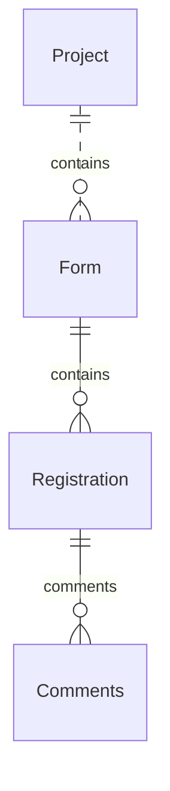
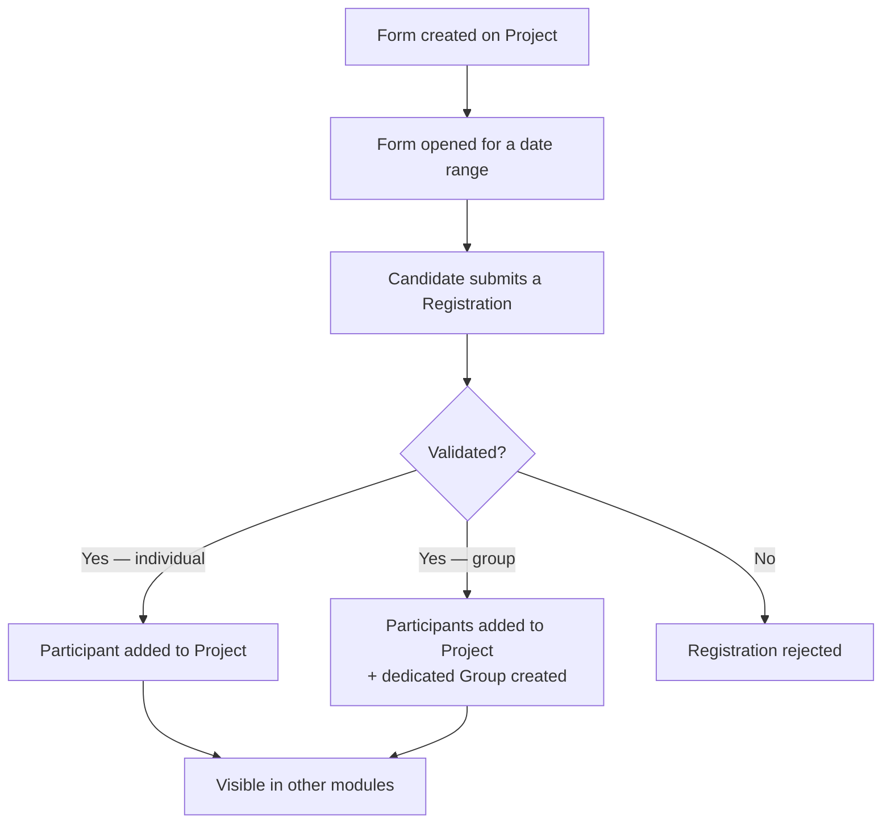

# Business Objects - Registration

This section describes the registration entities managed by the application (registration module).

The registration module is optional. It provides a self-service flow allowing individuals or groups to submit a
registration request for a project. The module requires the **REGISTRATION** option to be enabled on the project.

::: info Registration is not mandatory
Participants and groups can always be added directly to a project without going through the registration flow.
The registration module is an additional channel, not a prerequisite.
:::

## Entities

- [Form](/functional/business-objects/registration/form)
- [Registration](/functional/business-objects/registration/registration)

## Structure

> Dot relationships (`..`) are used to indicate related entities is from another module, while solid relationships (
`--`) indicate entities from the same module.
> All element are scoped to a project, but for readability we only show the project relationship on top-level entities (movement, alert, etc.).

## Flow overview

::: warning Visibility rule
A participant or group created through registration is **not visible** in other modules (movements, alerts, etc.)
until their registration has been validated.
:::
