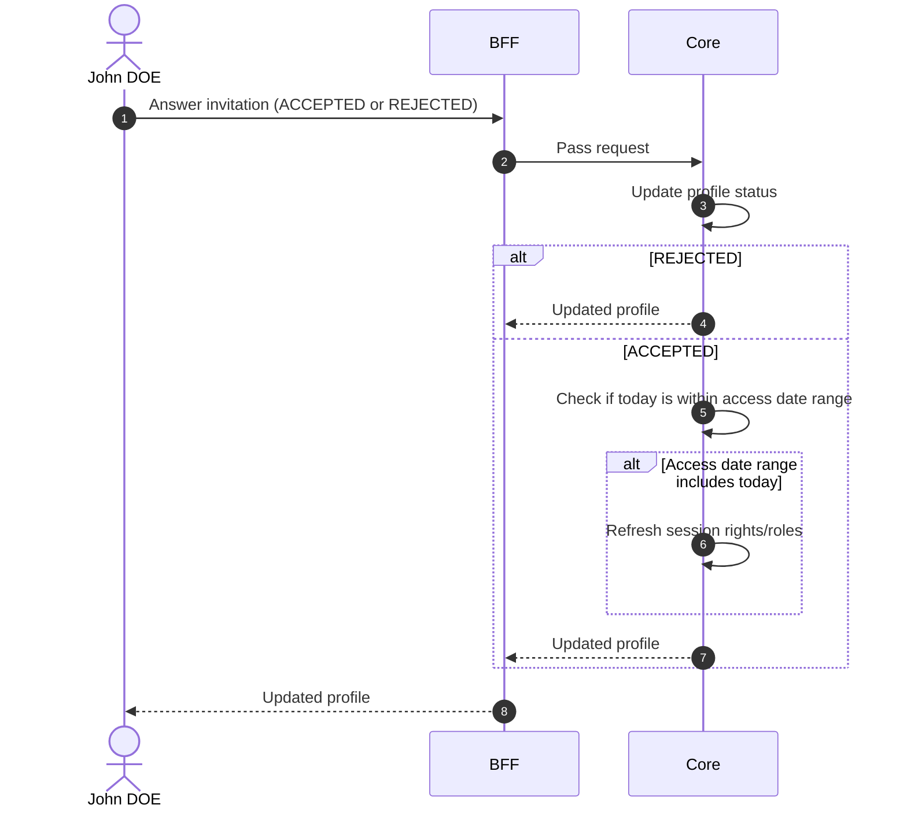

# Answer Profile Invitation

## Objects used

- [Profile](/functional/business-objects/core/profile)

## Allowed roles

- The user concerned by the profile

## Constraints

- Can only update status from `INVITED` to `ACCEPTED` or `REJECTED`
- If `ACCEPTED` and today falls within the profile's `access_start`/`access_end` range, the user's session rights and roles must be refreshed

## Workflow

