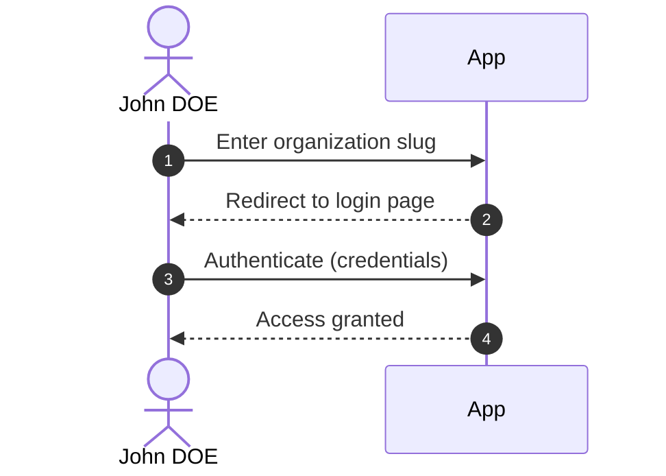
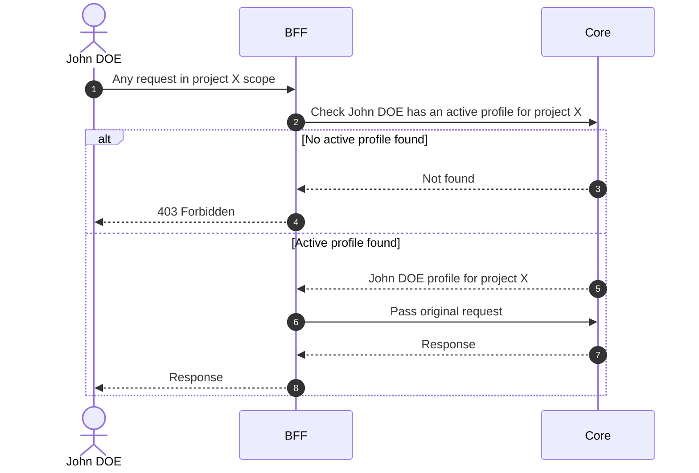

# Authentication

## Objects used

- [Profile](/functional/business-objects/core/profile)

## Login

Each organization has a unique **slug** used to identify it on the platform. The user enters their organization slug
to be redirected to the appropriate login page.

### Workflow

### External IdP

Organizations can configure their own identity provider. In that case, the user authenticates through their organization's login page instead of the default one.

Roles can be automatically assigned based on claims returned by the identity provider. This is configured during the organization onboarding process.

## Organization scope

All requests are automatically scoped to the user's organization context established at login.

::: warning
An exception is done for the `SUPER_ADMIN`. See [Roles](/functional/features/roles) for the full role model.
:::

## Project scope access check

Any request made in a project scope is automatically gated by a profile check. Before the request reaches the business logic, the BFF verifies that the authenticated user holds an active profile for the requested project.

If no active profile is found, the request is rejected.

### Workflow

