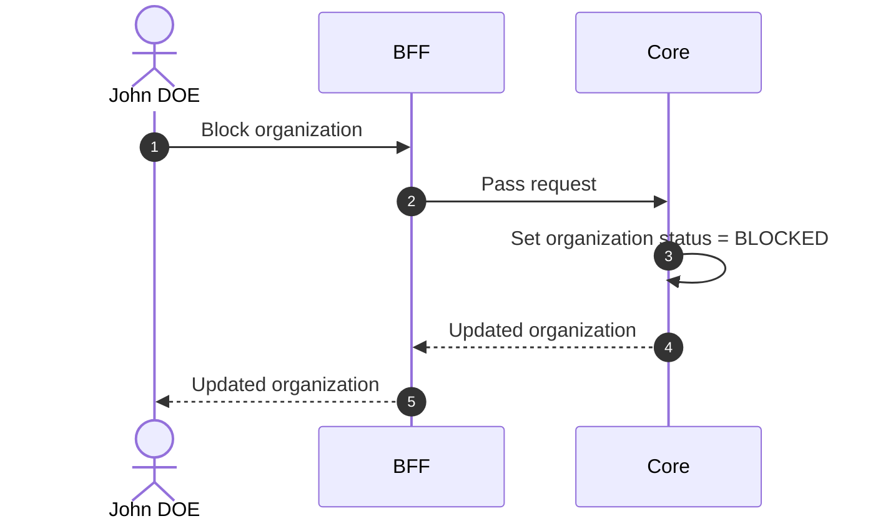

# Block Organization

## Objects used

- [Organization](/functional/business-objects/core/organization)

## Allowed roles

- `SUPER_ADMIN`

## Constraints

- All users belonging to that organization are prevented from logging in. Their authentication with the OIDC provider will succeed, but the application will reject the session because no active organization can be resolved for the slug.
- Existing data (projects, participants, movements, etc.) is preserved.
- `SUPER_ADMIN`s still see the organization, but it is marked `BLOCKED`.

::: warning Session impact
Access revocation is stateless and takes effect at each affected user's **next token refresh**, not immediately. The UI must clearly indicate this delay to avoid confusion.
:::

## Workflow

