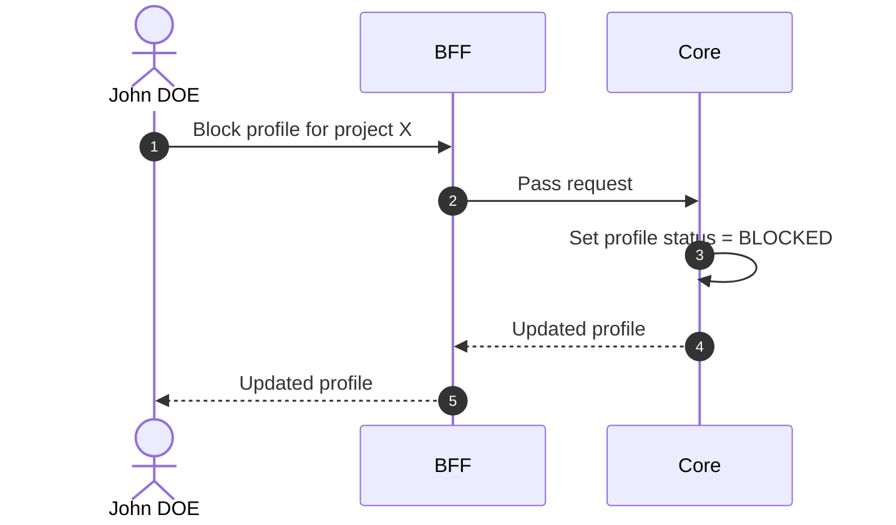

# Block Profile

## Objects used

- [Profile](/functional/business-objects/core/profile)

## Allowed roles

- `PROJECT_ADMIN`

## Constraints

- The user concerned by the profile cannot access the project anymore.
- `SUPPORT` profiles cannot be blocked.
- There must be at least one permanent profile with role `PROJECT_ADMIN` and type `DEFAULT` remaining in the project.
- `PROJECT_ADMIN`s still see the profile, but it is marked `BLOCKED`.

::: warning Session impact
Access revocation is stateless and takes effect at the affected user's **next token refresh**, not immediately. The UI must clearly indicate this delay to avoid confusion.
:::

## Workflow

::: info
Access to the project scope is automatically gated by the [authentication profile check](/functional/features/authentication#project-scope-access-check).
:::

