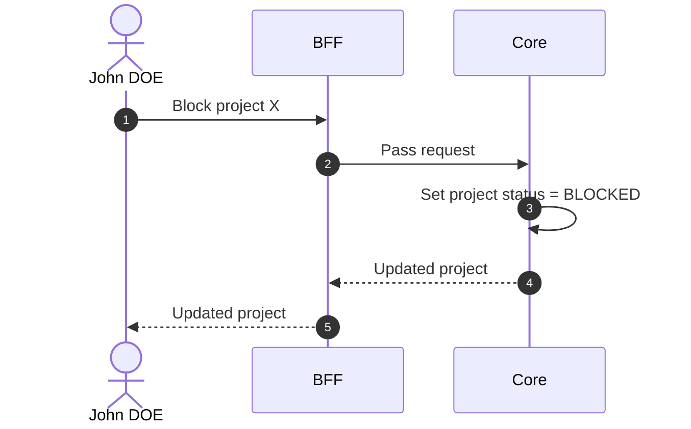

# Block Project

## Objects used

- [Project](/functional/business-objects/core/project)

## Allowed roles

- `SUPER_ADMIN`
- `ORGANIZATION_ADMIN`

## Constraints

- All users with a profile on that project are prevented from accessing it.
- Existing data (participants, movements, etc.) is preserved.
- `SUPER_ADMIN`s and `ORGANIZATION_ADMIN`s still see the project, but it is marked `BLOCKED`.

::: warning Session impact
Access revocation is stateless and takes effect at each affected user's **next token refresh**, not immediately. The UI must clearly indicate this delay to avoid confusion.
:::

## Workflow

