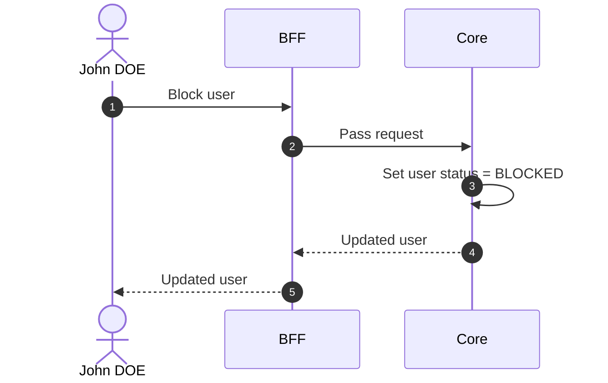

# Block User

## Objects used

- [User](/functional/business-objects/core/user)

## Allowed roles

- `SUPER_ADMIN`
- `ORGANIZATION_ADMIN`

## Constraints

- The user concerned cannot access the application anymore.
- `PROJECT_ADMIN`s and `ORGANIZATION_ADMIN`s still see the user, but it is marked `BLOCKED`.
- The user cannot be blocked if they are:
  - The last permanent `PROJECT_ADMIN` profile with type `DEFAULT` in a project
  - The last `ORGANIZATION_ADMIN` in an organization

::: warning Session impact
Access revocation is stateless and takes effect at the affected user's **next token refresh**, not immediately. The UI must clearly indicate this delay to avoid confusion.
:::

## Workflow

