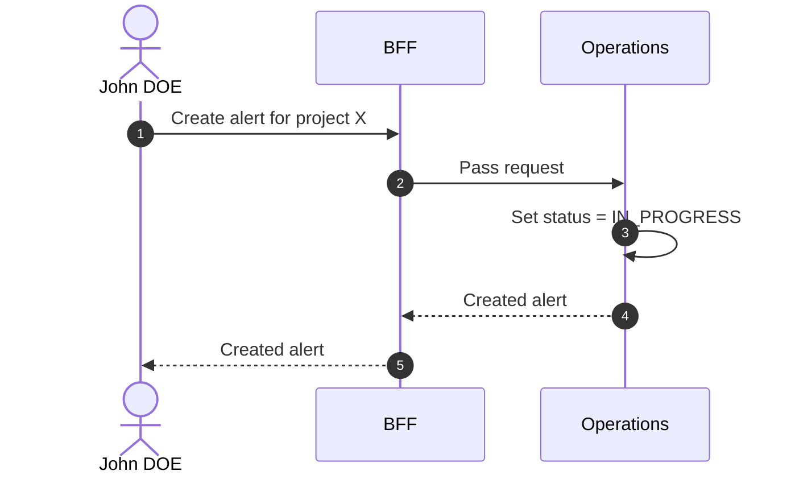

# Create Alert

::: info Option required
Requires the **ALERT** option (and **COMMUNICATION**) to be enabled on the project.
:::

## Objects used

- [Alert](/functional/business-objects/operations/alert)

## Allowed roles

- `PROJECT_ADMIN`
- `PROJECT_MANAGER`
- `PROJECT_USER`

## Constraints

- Title is required
- Description is optional
- Status is automatically set to `IN_PROGRESS`

## Workflow

::: info
Access to the project scope is automatically gated by the [authentication profile check](/functional/features/authentication#project-scope-access-check).
:::

