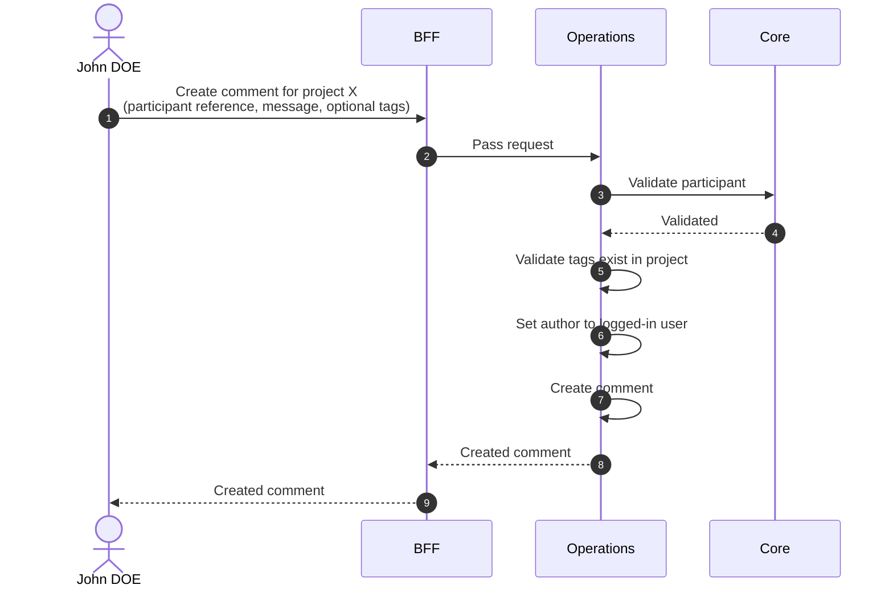

# Create Comment

::: info Option required
Requires the **COMMENT** option to be enabled on the project.
:::

## Objects used

- [Comment](/functional/business-objects/operations/comment)
- [Participant](/functional/business-objects/core/participant) — parent

## Allowed roles

- `PROJECT_ADMIN`
- `PROJECT_MANAGER`
- `PROJECT_USER`

## Constraints

- `message` is required.
- `participant` is required and must belong to the same project.
- Zero or more project-scoped [tags](/functional/business-objects/operations/comment#tags) can be attached.
  - Tags must exist in the project (tag creation happens in [Manage tags](/functional/features/manage-tags)).
- `author` is automatically set to the logged-in user.

## Workflow

::: info
Access to the project scope is automatically gated by the [authentication profile check](/functional/features/authentication#project-scope-access-check).
:::

