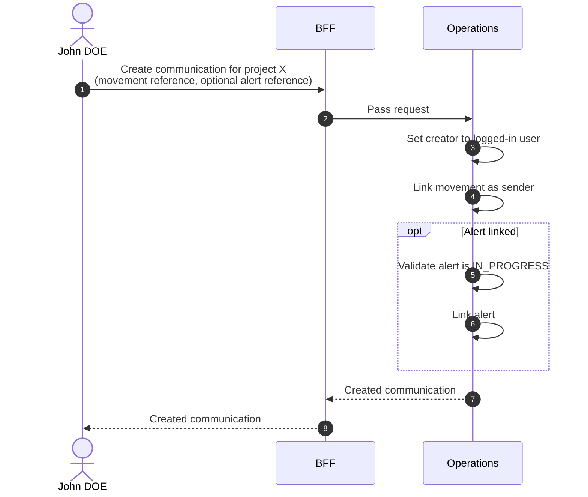
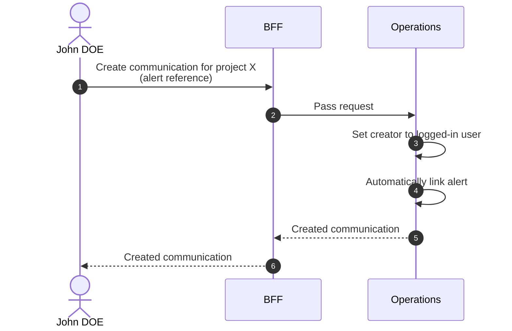

# Create Communication

::: info Option required
Requires the **COMMUNICATION** option to be enabled on the project.
:::

## Objects used

- [Communication](/functional/business-objects/operations/communication)
- [Alert](/functional/business-objects/operations/alert) — optional
- [Movement](/functional/business-objects/operations/movement) — optional sender

## Allowed roles

- `PROJECT_ADMIN`
- `PROJECT_MANAGER`
- `PROJECT_USER`

## Constraints

- Message is required
- Alert:
  - Can be linked through a movement message
  - Is automatically set if the communication is created within an alert
  - Alert must be `IN_PROGRESS` to be associated
- Movement (sender) is optional. If not selected, the logged-in user is the author.
  - Selected movement must be in progress: an `OUT` movement of `REGISTERED` participants.
- Creator is automatically set to the logged-in user

::: info UI/UX
Communication creation should be facilitated for movements linked to an activity. A counter showing the last communication with that activity should be displayed.
:::

## Workflow

::: info
Access to the project scope is automatically gated by the [authentication profile check](/functional/features/authentication#project-scope-access-check).
:::

### In movement context

The communication is created from a movement. The movement is the sender. An alert can optionally be linked.

### In alert context

The communication is created from an alert. The alert is automatically linked. The logged-in user is the author.

