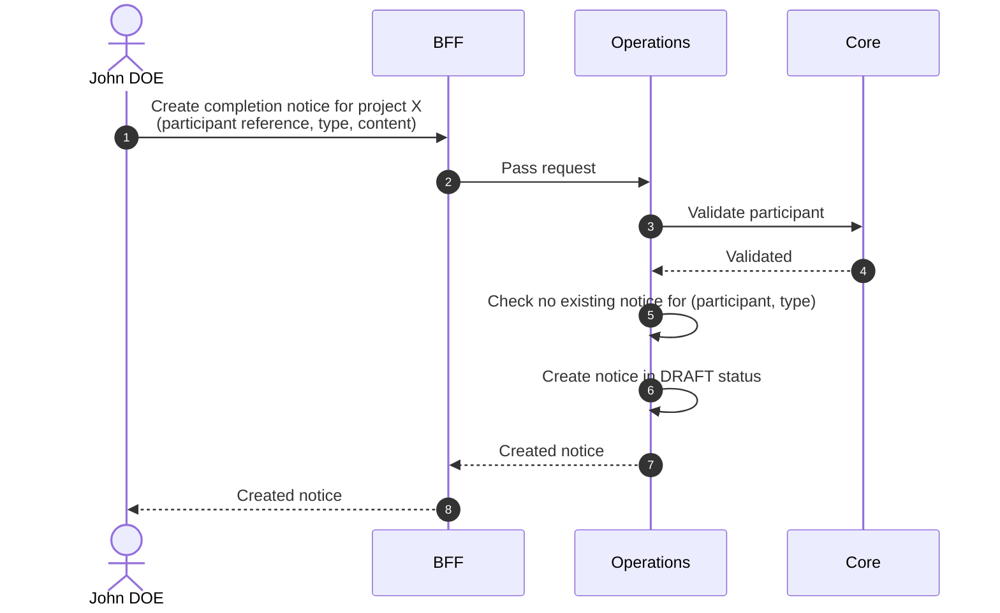

# Create Completion Notice

::: info Option required
Requires the **COMPLETION_NOTICE** option to be enabled on the project.
:::

## Objects used

- [Completion Notice](/functional/business-objects/operations/completion-notice)
- [Participant](/functional/business-objects/core/participant) — parent

## Allowed roles

- `PROJECT_ADMIN`
- `PROJECT_MANAGER`

## Constraints

- `participant` is required and must belong to the project.
- `type` is required: `INTERNAL` or `EXTERNAL`.
- A participant can have at most one notice **per type**. Creating a second notice of the same type for the same participant is rejected.
- The notice is created in `DRAFT` status. Publication happens through [Publish completion notice](/functional/features/publish-completion-notice).

## Workflow

::: info
Access to the project scope is automatically gated by the [authentication profile check](/functional/features/authentication#project-scope-access-check).
:::

