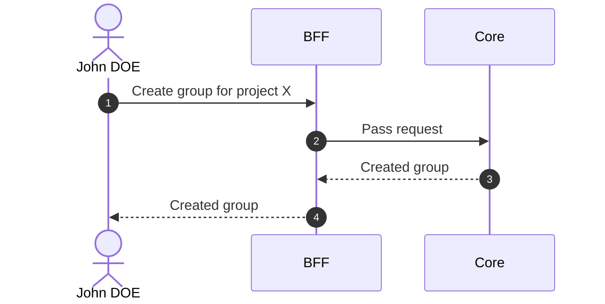

# Create Group

::: info Option required
Requires the **GROUP** option to be enabled on the project.
:::

## Objects used

- [Group](/functional/business-objects/core/group)

## Allowed roles

- `PROJECT_ADMIN`
- `PROJECT_MANAGER`

## Constraints

- Name is required
- Attendance dates are optional

## Workflow

::: info
Access to the project scope is automatically gated by the [authentication profile check](/functional/features/authentication#project-scope-access-check).
:::

