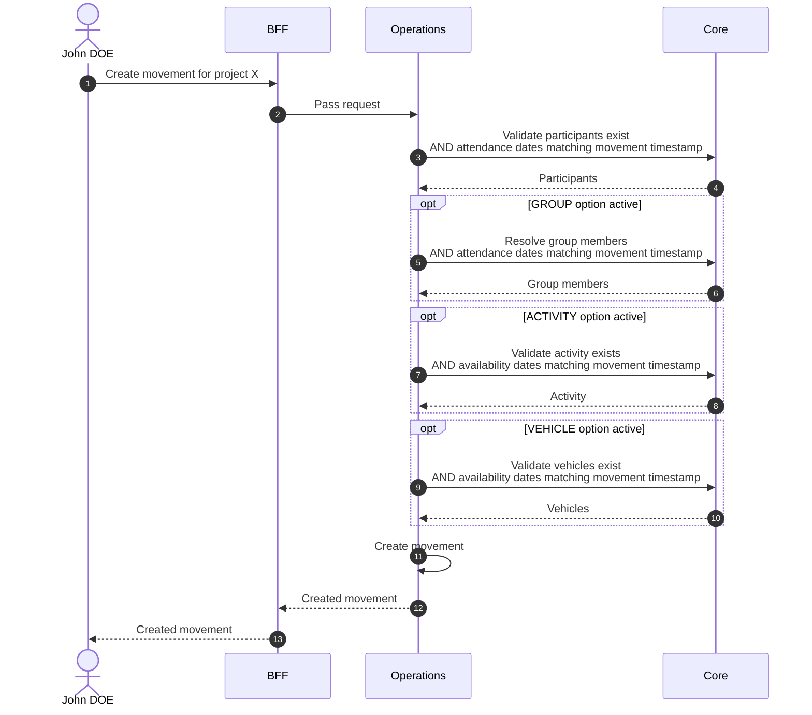
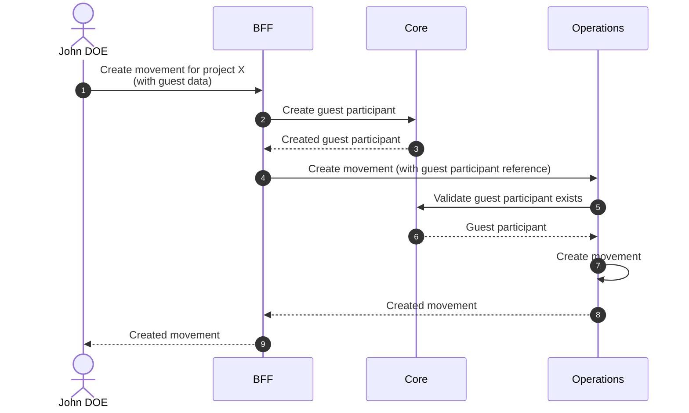

# Create Movement

## Objects used

- [Movement](/functional/business-objects/operations/movement)
- [Project](/functional/business-objects/core/project) — to determine active options
- [Participant](/functional/business-objects/core/participant) — via [autocomplete search](/functional/features/search-participants#autocomplete) or guest creation
- [Activity](/functional/business-objects/core/activity) — *(if ACTIVITY option active)* via [autocomplete search](/functional/features/search-activities#autocomplete)
- [Vehicle](/functional/business-objects/core/vehicle) — *(if VEHICLE option active)* via [autocomplete search](/functional/features/search-vehicles#autocomplete)
- [Group](/functional/business-objects/core/group) — *(if GROUP option active)* via [autocomplete search](/functional/features/search-groups#autocomplete)

## Allowed roles

- `PROJECT_ADMIN`
- `PROJECT_MANAGER`
- `PROJECT_USER`

## Constraints

- Timestamp is required (defaults to current time; can be set to any past datetime — future datetimes are not allowed)
- Direction is required (`IN` or `OUT`)
- At least one participant is required
- Reason is required depending on direction and participant type (see [Movement reasons](/functional/business-objects/operations/movement#reason))
- Activity is optional *(if ACTIVITY option active)*
- Vehicle is optional per participant *(if VEHICLE option active; driver must be a major at movement timestamp)*

::: warning Mixed participant types
A single movement cannot contain both `REGISTERED` and `GUEST` participants.
:::

::: warning Guest movement limit
A `GUEST` participant is limited to exactly two movements for the whole lifetime of the project: one `IN` and the matching `OUT`. No further movement can be created for a guest once these two exist.
:::

## Adding participants via group

When participants are added through a group, the group name is captured as a **pool name
** — a snapshot taken at movement time, preserved independently of any subsequent rename or deletion of the group.

You can remove individual participants from the selection without removing them from the group itself.

## Guest participant creation

When creating a movement with
`GUEST` participants, a guest must be created inline. See [Create Participant](/functional/features/create-participant#guest-participant) for the guest creation rules.

A guest requires:

- Lastname
- Firstname
- Birthday
- A reason for entry (see [Guest entry reasons](/functional/business-objects/operations/movement#reasons-for-a-guest-coming-in))

## Workflow

::: info
Access to the project scope is automatically gated by the [authentication profile check](/functional/features/authentication#project-scope-access-check).
:::

### With registered participants

### With guest participants

::: info Group, Vehicle and Activity options
For `GUEST` participants, the `GROUP`, `VEHICLE` and `ACTIVITY` options are not applicable since guests cannot be
members of a group, drivers of a vehicle or assigned to an activity.
:::
