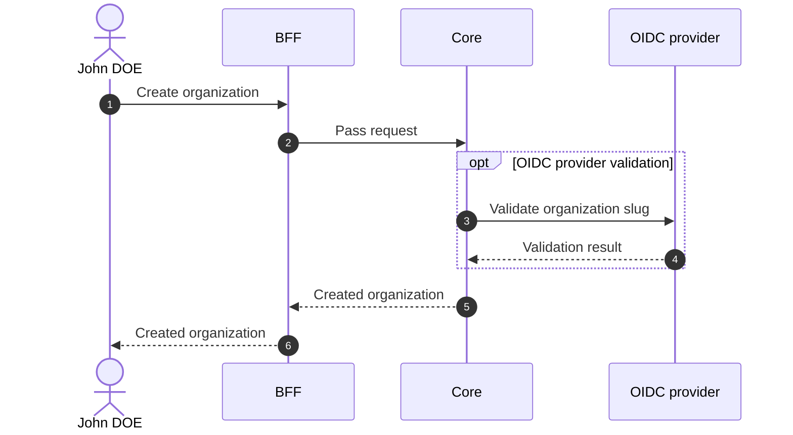

# Create Organization

## Objects used

- [Organization](/functional/business-objects/core/organization)

## Allowed roles

- `SUPER_ADMIN`

## Constraints

- `name` is required.
- `slug` is required.
- Options are optional (no option given means no option active).
- `is_strict_auth` is **required** at creation. It can be edited afterwards via [Edit organization](/functional/features/edit-organization).
- `is_main` is **required** at creation. It can be edited afterwards via [Edit organization](/functional/features/edit-organization). Changing this flag later has side effects: every user in the newly-main organization gains the `SUPER_ADMIN` role; conversely, demoting the main organization revokes it from all of its users.

## Workflow

