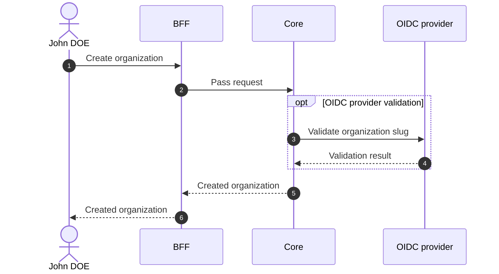

# Create Organization

## Objects used

- [Organization](/functional/business-objects/core/organization)

## Allowed roles

- `SUPER_ADMIN`

## Constraints

- Name is required
- Slug is required
- Options are optional (no option given means no option active)
- `is_strict_auth` is required
- `is_main` is required

## Workflow

