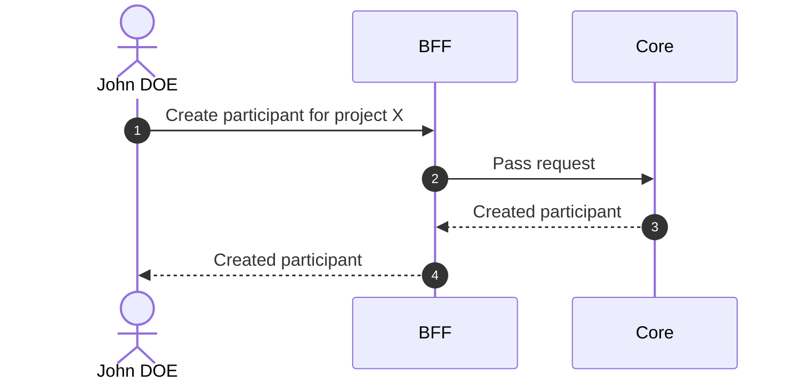
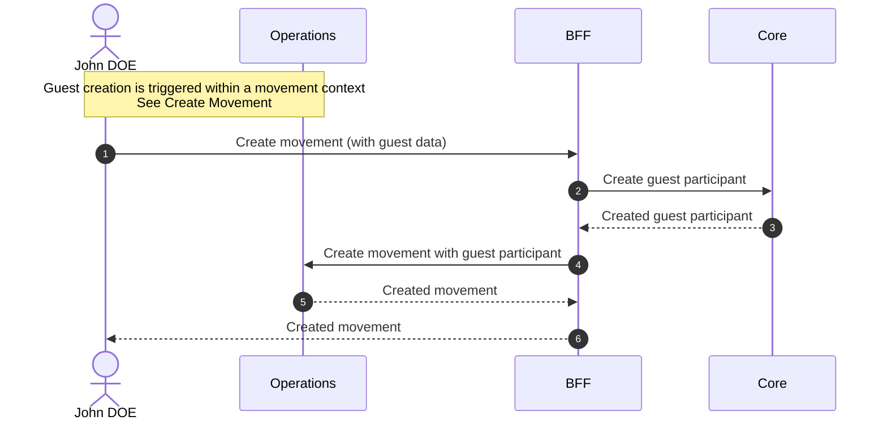

# Create Participant

## Objects used

- [Participant](/functional/business-objects/core/participant)

## Allowed roles

- `PROJECT_ADMIN`
- `PROJECT_MANAGER`
- `PROJECT_USER` → Only for `GUEST` participants

## Constraints

- Lastname is required
- Firstname is required
- Birthday is required
- Type is automatically determined by context: participants created outside of a movement are `REGISTERED`
- Attendance dates are optional
- User link is optional

## Workflow

::: info
Access to the project scope is automatically gated by the [authentication profile check](/functional/features/authentication#project-scope-access-check).
:::

### Registered participant

### Guest participant

## Guest participant

A `GUEST` participant is a lightweight variant created at the time of a movement (see [Create Movement](/functional/features/create-movement)). Unlike a `REGISTERED` participant, a guest has no project history outside of the movement they were created for.

Guest lifecycle is limited to two movements: one `IN` and one `OUT`. No further movements can be recorded after the guest has gone out.
