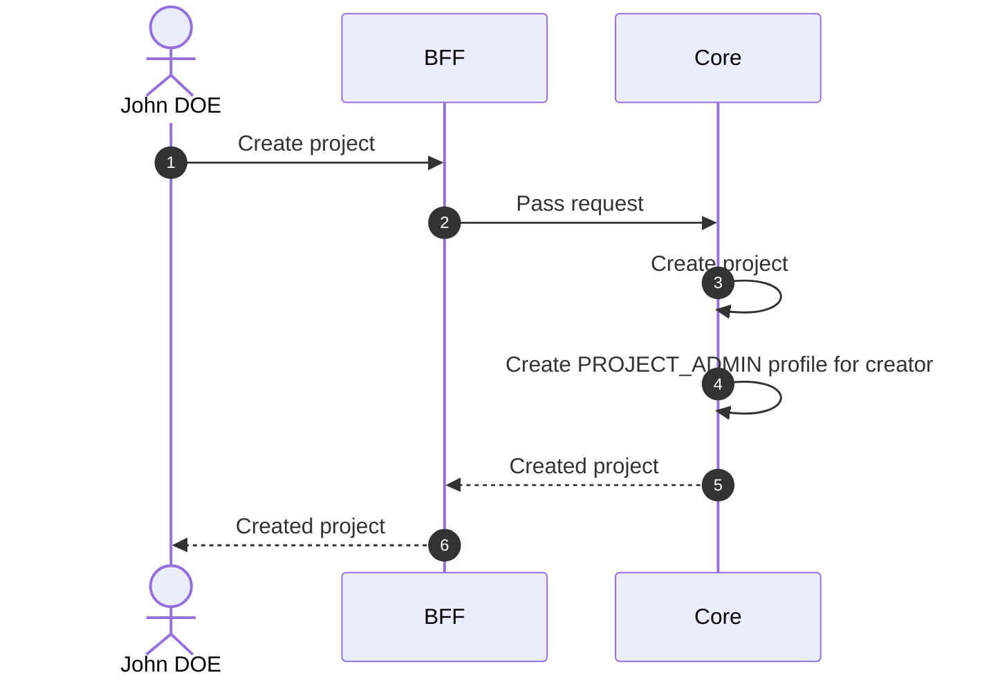

# Create Project

## Objects used

- [Project](/functional/business-objects/core/project)
- [Profile](/functional/business-objects/core/profile)

## Allowed roles

- `SUPER_ADMIN`
- `ORGANIZATION_ADMIN`
- `ORGANIZATION_USER`

## Constraints

- Name is required
- Options are optional (no option given means no option active)
- Schedule dates are optional

::: warning Automatic profile creation
When a user creates a project, a [profile](/functional/business-objects/core/profile) is automatically created for the creator with role `PROJECT_ADMIN` and invitation status `ACCEPTED`.
:::

## Workflow

