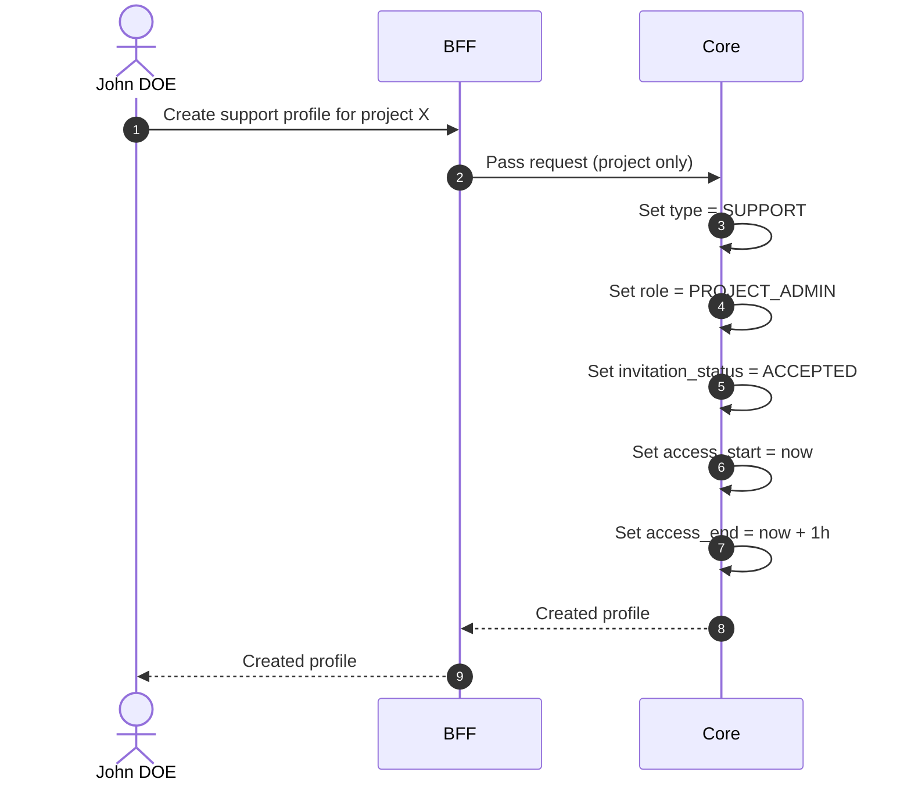

# Create Support Profile

## Objects used

- [Profile](/functional/business-objects/core/profile)

## Allowed roles

- `SUPER_ADMIN` — all projects
- `ORGANIZATION_ADMIN` — limited to projects within their organization scope

## Constraints

- Project is required
- Type is automatically set to `SUPPORT`
- Role is automatically set to `PROJECT_ADMIN`
- Invitation status is automatically set to `ACCEPTED`
- Access start is automatically set to the current datetime
- Access end is automatically set to access start + 1 hour

::: warning Server-side enforcement
The frontend does **not** send role, invitation status, or access dates. These values are set exclusively by Core to prevent tampering.
:::

## Workflow

