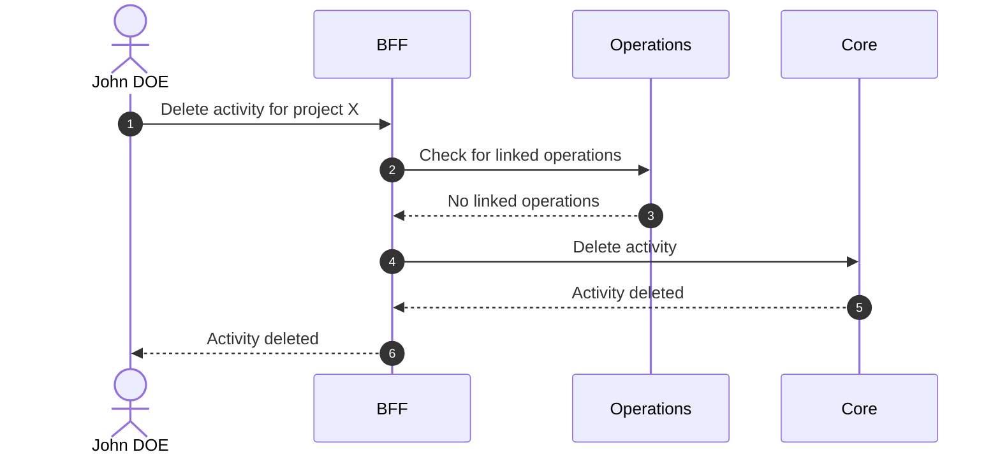

# Delete Activity

::: info Delete ≠ Disable
Delete is a permanent removal from the database.
:::

::: info Option required
Requires the **ACTIVITY** option to be enabled on the project.
:::

## Objects used

- [Activity](/functional/business-objects/core/activity)

## Allowed roles

- `PROJECT_ADMIN`

## Constraints

- The deletion must not affect the [operations](/functional/business-objects/operations) module.
- The deletion cannot be rolled back

## Workflow

::: info
Access to the project scope is automatically gated by the [authentication profile check](/functional/features/authentication#project-scope-access-check).
:::

