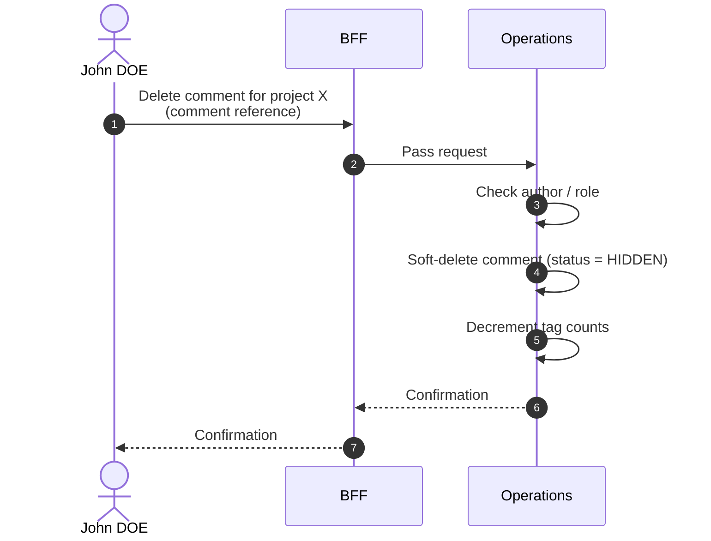

# Delete Comment

::: info Option required
Requires the **COMMENT** option to be enabled on the project.
:::

::: info Soft-delete
"Delete" here means soft-delete: the comment transitions to the `HIDDEN` state and is excluded from listings, but the record is preserved. See [Soft-delete](/glossary#soft-delete).
:::

## Objects used

- [Comment](/functional/business-objects/operations/comment)

## Allowed roles

- `PROJECT_ADMIN`
- `PROJECT_MANAGER`
- `PROJECT_USER` — only on comments they authored themselves

## Constraints

- Target comment must exist and must not already be `HIDDEN`.
- Tag counts linked to the comment are decremented.

## Workflow

::: info
Access to the project scope is automatically gated by the [authentication profile check](/functional/features/authentication#project-scope-access-check).
:::

