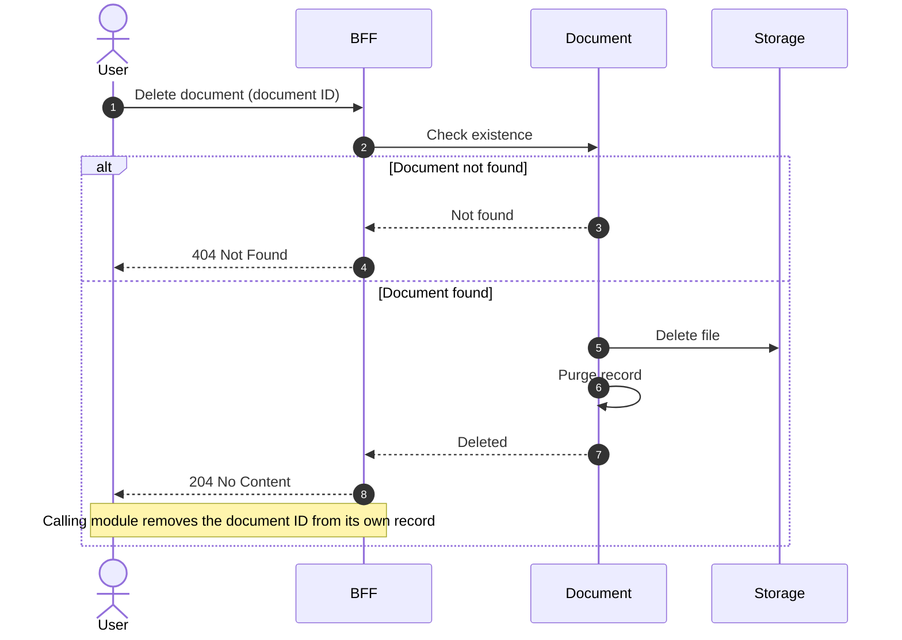

# Delete Document

## Objects used

- [Document](/functional/business-objects/document/)

## Allowed roles

Permissions depend on the document type. The document type configuration defines which roles are authorized to delete documents of that type.

## Constraints

- Document must exist
- Deletion is permanent: the file is removed from storage and the document record is purged

::: info Caller responsibility
The document module only deletes the document record and its file. The consuming module is responsible for removing the document ID from its own record after a successful deletion.
:::

::: warning Irreversible operation
Document deletion is a hard delete. Neither the file nor the metadata can be recovered after deletion.
:::

## Workflow

::: info
Access to the project or organization scope is automatically gated by the [authentication profile check](/functional/features/authentication#project-scope-access-check).
:::

