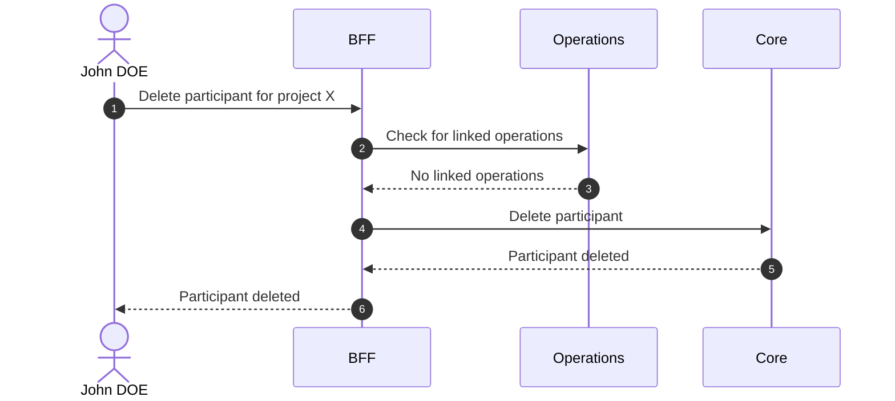

# Delete Participant

::: info Delete ≠ Disable ≠ Purge
Delete is a permanent removal from the database and ignores purge conditions.
:::

## Objects used

- [Participant](/functional/business-objects/core/participant)

## Allowed roles

- `PROJECT_ADMIN`

## Constraints

- A participant must have no related [operations](/functional/business-objects/operations) to be deleted.
- The deletion cannot be rolled back

::: tip Participant created by mistake
If a participant was created by mistake but is already included in a movement, deletion is not possible. Use [disable](/functional/features/disable-participant) or set a past departure date instead.
:::

## Workflow

::: info
Access to the project scope is automatically gated by the [authentication profile check](/functional/features/authentication#project-scope-access-check).
:::

