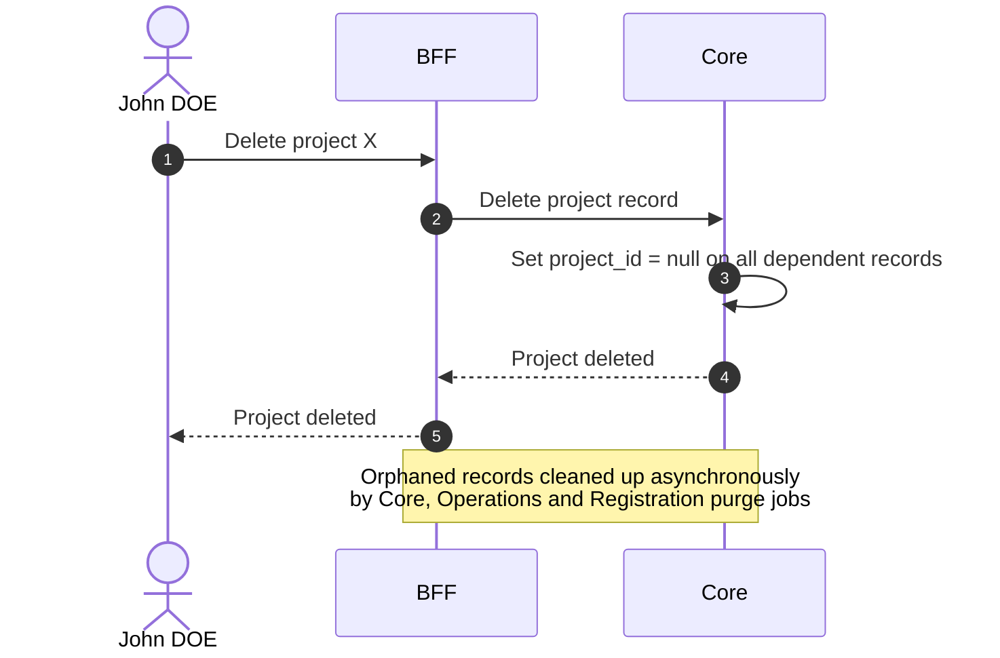

# Delete Project

::: info Delete ≠ Block
Delete is a permanent removal from the database.
:::

## Objects used

- [Project](/functional/business-objects/core/project)

## Allowed roles

- `SUPER_ADMIN`
- `ORGANIZATION_ADMIN`

## Constraints

- Must delete all dependent content (participants, movements, etc.)
- The deletion cannot be rolled back

::: info Asynchronous cleanup
Deleting a project only removes the project record itself. All foreign keys in dependent records are set to null. This choice prevents overloading database I/O and gives a quick response to the user, without waiting for the full deletion or launching an async job without a success status.

Three dedicated purge jobs then clean up orphaned data in each module independently:

- [Purge Orphan Core Data](/functional/features/purge-orphan-core)
- [Purge Orphan Operations Data](/functional/features/purge-orphan-operations)
- [Purge Orphan Registration Data](/functional/features/purge-orphan-registration)
  :::

## Workflow

