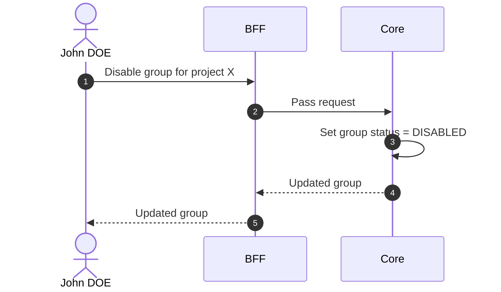

# Disable Group

::: info Option required
Requires the **GROUP** option to be enabled on the project.
:::

## Objects used

- [Group](/functional/business-objects/core/group)

## Allowed roles

- `PROJECT_ADMIN`
- `PROJECT_MANAGER`

## Constraints

- The soft-deletion must not impact the [operations](/functional/business-objects/operations) module.
- `PROJECT_ADMIN`s still see the group, but it is marked `DISABLED`.

::: warning Membership impact
When a group is disabled, all group memberships are **no longer considered active**. Participants who belonged to the group lose that membership until the group is re-enabled.
:::

## Workflow

::: info
Access to the project scope is automatically gated by the [authentication profile check](/functional/features/authentication#project-scope-access-check).
:::

