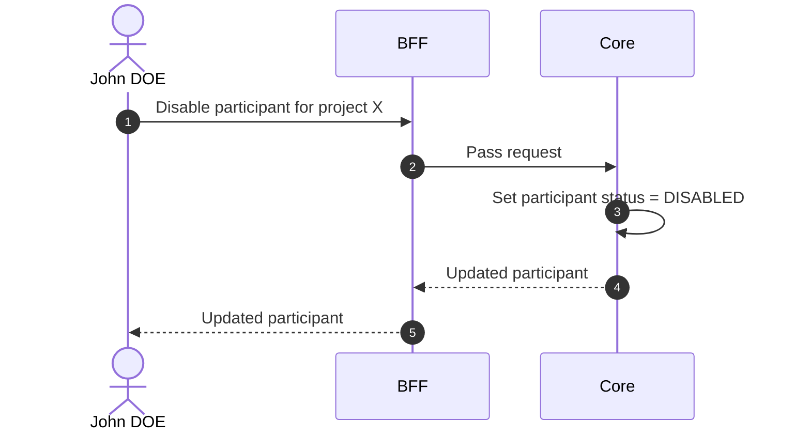

# Disable Participant

## Objects used

- [Participant](/functional/business-objects/core/participant)

## Allowed roles

- `PROJECT_ADMIN`
- `PROJECT_MANAGER`

## Constraints

- The soft-deletion must not impact the [operations](/functional/business-objects/operations/) module.
- `PROJECT_ADMIN`s still see the participant, but it is marked `DISABLED`.

## Workflow

::: info
Access to the project scope is automatically gated by the [authentication profile check](/functional/features/authentication#project-scope-access-check).
:::

