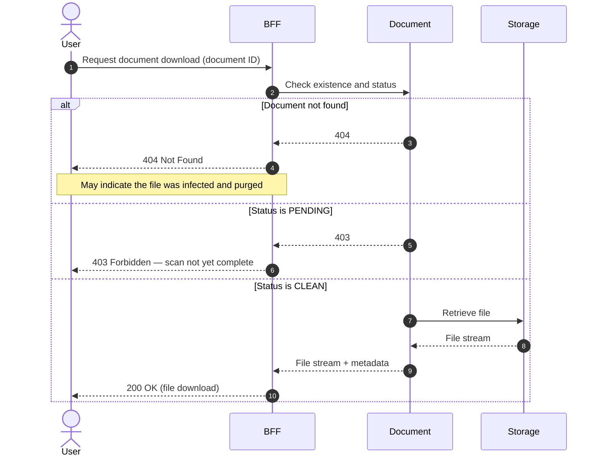

# Download Document

## Objects used

- [Document](/functional/business-objects/document/)

## Allowed roles

Permissions depend on the document type. The document type configuration defines which roles are authorized to download documents of that type.

## Constraints

- Document must exist
- Document status must be `CLEAN`; a document in `PENDING` status is not yet accessible

## Workflow

