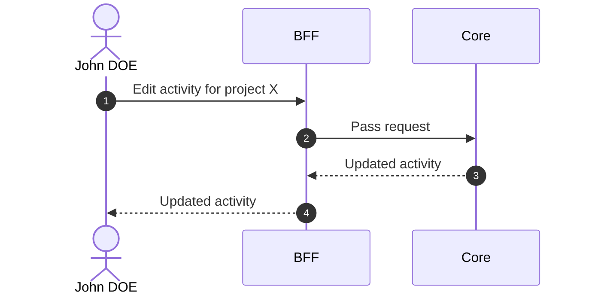

# Edit Activity

::: info Option required
Requires the **ACTIVITY** option to be enabled on the project.
:::

## Objects used

- [Activity](/functional/business-objects/core/activity)

## Allowed roles

- `PROJECT_ADMIN`
- `PROJECT_MANAGER`

## Constraints

Same constraints as [Create Activity](/functional/features/create-activity).

## Workflow

::: info
Access to the project scope is automatically gated by the [authentication profile check](/functional/features/authentication#project-scope-access-check).
:::

