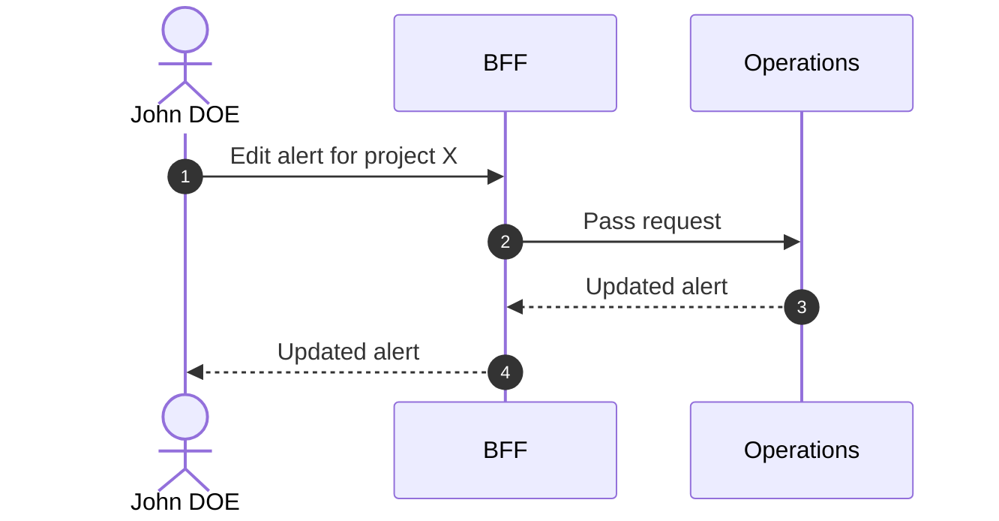

# Edit Alert

::: info Option required
Requires the **ALERT** option to be enabled on the project.
:::

::: info In-place edit
Alert supports a true in-place edit. Only Movement is immutable in Operations — see the [Editability policy](/functional/business-objects/operations/#editability-of-operations-entities).
:::

## Objects used

- [Alert](/functional/business-objects/operations/alert)

## Allowed roles

- `PROJECT_ADMIN`
- `PROJECT_MANAGER`
- `PROJECT_USER`

## Constraints

- `title`, `description`, and `status` are editable in place.
- `status` transitions follow the state machine defined in [Alert — Transitions](/functional/business-objects/operations/alert#transitions).

## Workflow

::: info
Access to the project scope is automatically gated by the [authentication profile check](/functional/features/authentication#project-scope-access-check).
:::

