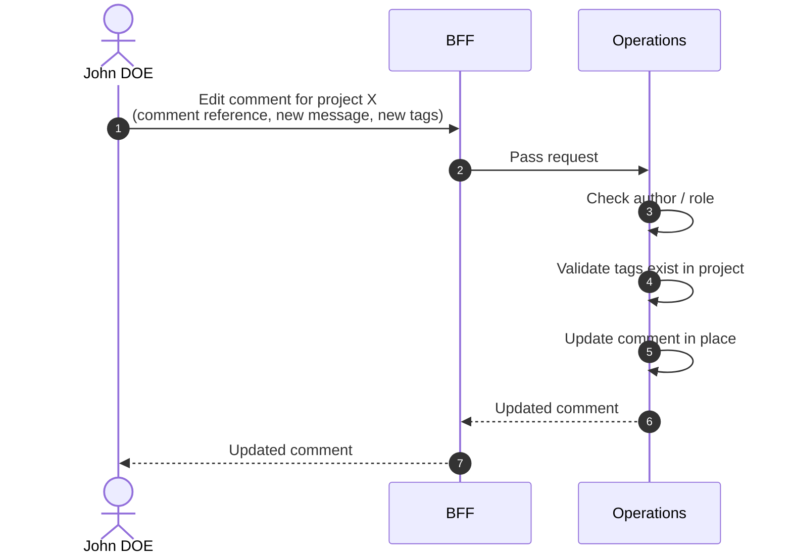

# Edit Comment

::: info Option required
Requires the **COMMENT** option to be enabled on the project.
:::

::: info In-place edit
A Comment is not part of the operational log and supports a true in-place edit (message and tags). See the [Editability policy](/functional/business-objects/operations/#editability-of-operations-entities).
:::

## Objects used

- [Comment](/functional/business-objects/operations/comment)

## Allowed roles

- `PROJECT_ADMIN`
- `PROJECT_MANAGER`
- `PROJECT_USER` — only on comments they authored themselves

## Constraints

- `message` and `tags` are editable in place.
- `author`, `participant`, and creation timestamp are immutable.
- Tags must exist in the project (see [Manage tags](/functional/features/manage-tags)).
- A soft-deleted comment (`HIDDEN`) cannot be edited.

## Workflow

::: info
Access to the project scope is automatically gated by the [authentication profile check](/functional/features/authentication#project-scope-access-check).
:::

