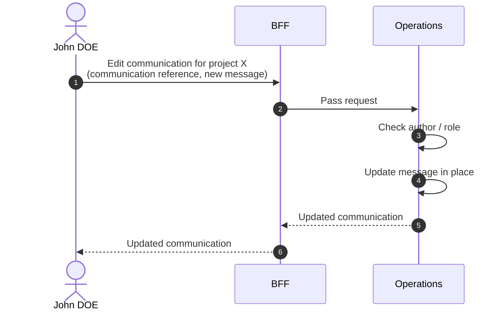

# Edit Communication

::: info In-place edit
Editing a communication updates its `message` in place. The original record is preserved — no soft-delete, no recreation.
:::

## Objects used

- [Communication](/functional/business-objects/operations/communication)

## Allowed roles

- `PROJECT_ADMIN`
- `PROJECT_MANAGER`
- `PROJECT_USER` — only on communications they authored themselves

## Constraints

- Only `message` is editable. The parent (alert or movement), the sender, the creator, and the creation timestamp are immutable.
- A `HIDDEN` (soft-deleted) communication cannot be edited.

## Workflow

::: info
Access to the project scope is automatically gated by the [authentication profile check](/functional/features/authentication#project-scope-access-check).
:::

