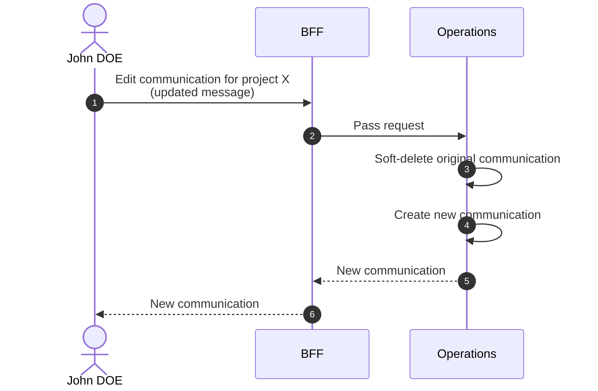

# Edit Communication

::: warning Not a real edit
Editing a communication soft-deletes the existing one and creates a new one pre-filled with the original data. The form is pre-filled with the original data.
:::

::: info Option required
Requires the **COMMUNICATION** option to be enabled on the project.
:::

## Objects used

- [Communication](/functional/business-objects/operations/communication)

## Allowed roles

- `PROJECT_ADMIN`
- `PROJECT_MANAGER`
- `PROJECT_USER`

## Constraints

- Only the message is editable

## Workflow

::: info
Access to the project scope is automatically gated by the [authentication profile check](/functional/features/authentication#project-scope-access-check).
:::

