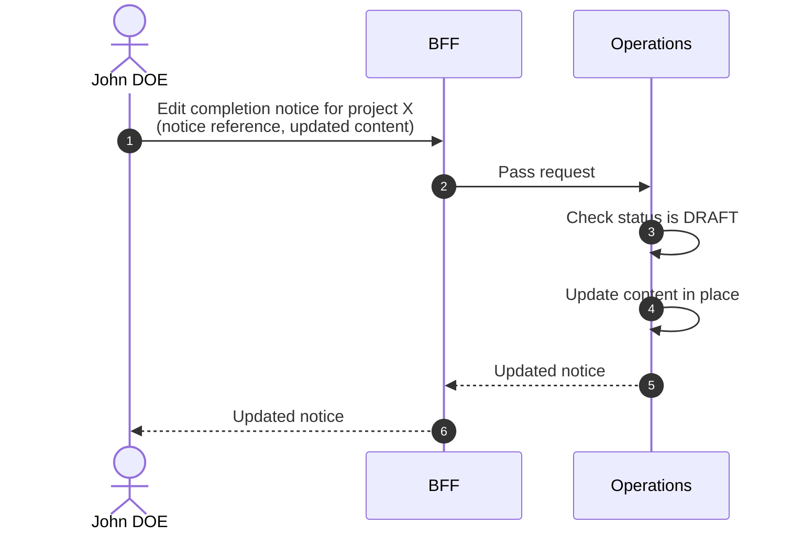

# Edit Completion Notice

::: info Option required
Requires the **COMPLETION_NOTICE** option to be enabled on the project.
:::

::: warning DRAFT only
A completion notice can be edited only while in `DRAFT`. Once `PUBLISHED`, the notice is immutable.
:::

## Objects used

- [Completion Notice](/functional/business-objects/operations/completion-notice)

## Allowed roles

- `PROJECT_ADMIN`
- `PROJECT_MANAGER`

## Constraints

- Target notice must be in `DRAFT` status.
- `content` can be edited in place.
- `type` and `participant` are immutable once the notice exists (delete and recreate to change them).

## Workflow

::: info
Access to the project scope is automatically gated by the [authentication profile check](/functional/features/authentication#project-scope-access-check).
:::

