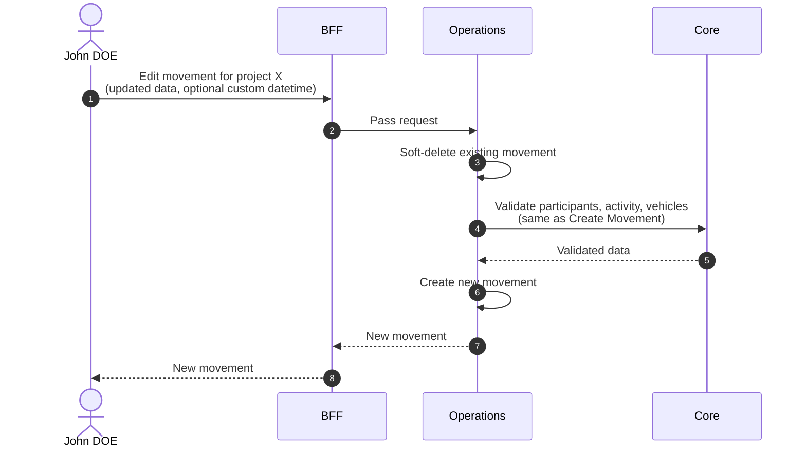

# Edit Movement

::: warning Not a real edit
Editing a movement is not a true update — it soft-deletes the existing movement and creates a new one pre-filled with the original data. A custom
`datetime` can be supplied to reflect the actual time of the event.
:::

## Objects used

- [Movement](/functional/business-objects/operations/movement)

## Allowed roles

- `PROJECT_ADMIN`
- `PROJECT_MANAGER`
- `PROJECT_USER`

## Constraints

Same constraints as [Create Movement](/functional/features/create-movement).

## Workflow

::: info
Access to the project scope is automatically gated by the [authentication profile check](/functional/features/authentication#project-scope-access-check).
:::

