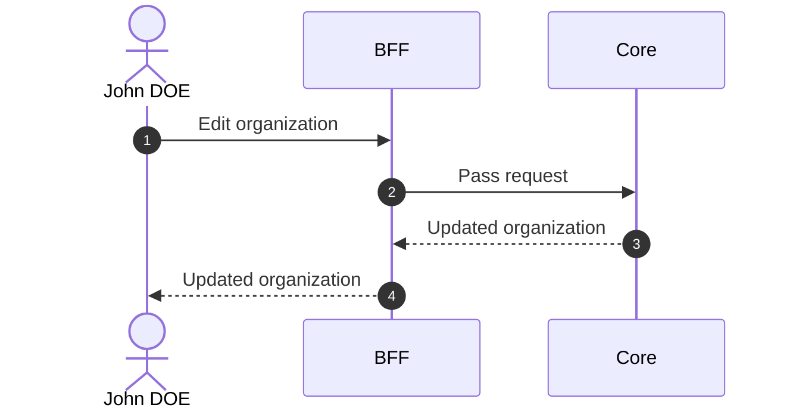

# Edit Organization

## Objects used

- [Organization](/functional/business-objects/core/organization)

## Allowed roles

- `SUPER_ADMIN`
- `ORGANIZATION_ADMIN`

## Constraints

Same fields as [Create Organization](/functional/features/create-organization), with these differences:

- `slug` is immutable after creation (it is bound to the configured OIDC provider and cannot be rewritten).
- `ORGANIZATION_ADMIN`s cannot edit `is_main`. Only `SUPER_ADMIN`s can toggle it. Flipping `is_main` grants or revokes `SUPER_ADMIN` on every user of the organization.
- `is_strict_auth` can be toggled by both roles.

## Workflow

