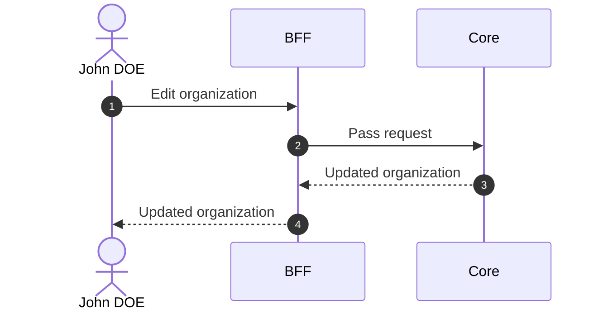

# Edit Organization

## Objects used

- [Organization](/functional/business-objects/core/organization)

## Allowed roles

- `SUPER_ADMIN`
- `ORGANIZATION_ADMIN`

## Constraints

- `ORGANIZATION_ADMIN`s cannot edit slug or `is_main` field

## Workflow

