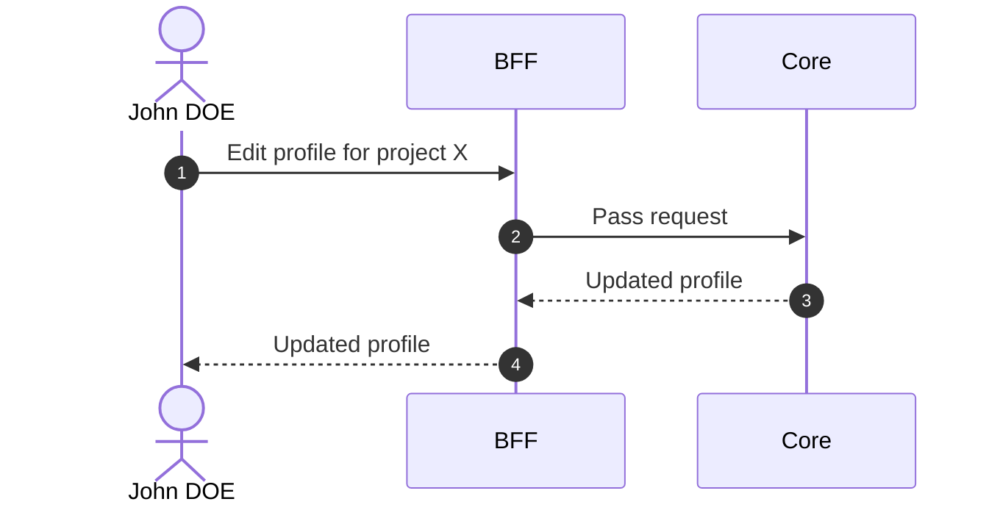

# Edit Profile

## Objects used

- [Profile](/functional/business-objects/core/profile)

## Allowed roles

- `PROJECT_ADMIN`

## Constraints

- Type cannot be changed
- Invitation status cannot be changed
- A user **cannot edit their own profile**. Profile modifications must be performed by another `PROJECT_ADMIN`.

## Workflow

::: info
Access to the project scope is automatically gated by the [authentication profile check](/functional/features/authentication#project-scope-access-check).
:::

