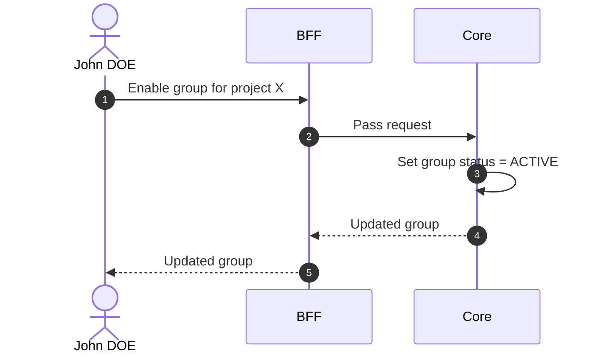

# Enable Group

::: info Option required
Requires the **GROUP** option to be enabled on the project.
:::

## Objects used

- [Group](/functional/business-objects/core/group)

## Allowed roles

- `PROJECT_ADMIN`

## Constraints

- Only applicable to `DISABLED` groups
- Members regain their membership upon re-enabling

## Workflow

::: info
Access to the project scope is automatically gated by the [authentication profile check](/functional/features/authentication#project-scope-access-check).
:::

