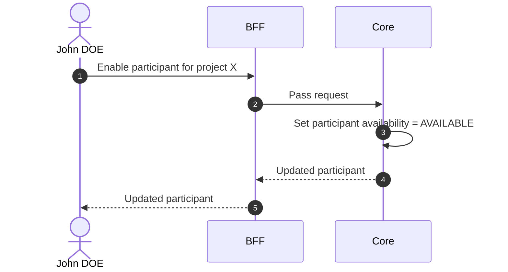

# Enable Participant

## Objects used

- [Participant](/functional/business-objects/core/participant)

## Allowed roles

- `PROJECT_ADMIN`

## Constraints

- Only applicable to `DISABLED` participants

## Workflow

::: info
Access to the project scope is automatically gated by the [authentication profile check](/functional/features/authentication#project-scope-access-check).
:::

