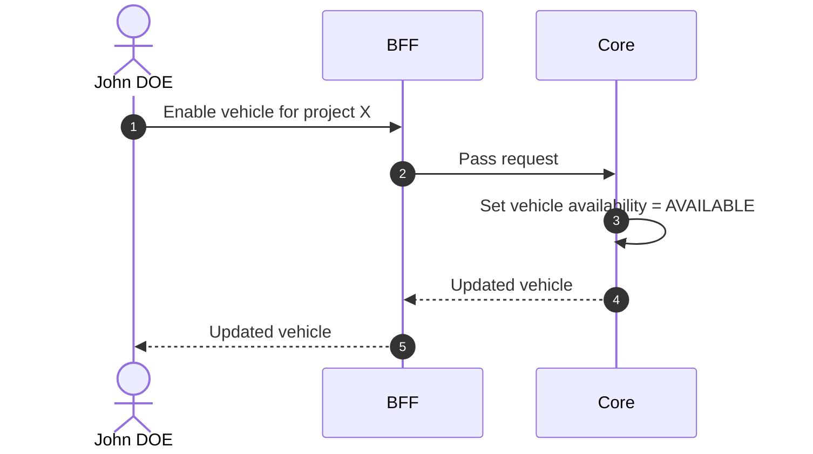

# Enable Vehicle

::: info Option required
Requires the **VEHICLE** option to be enabled on the project.
:::

## Objects used

- [Vehicle](/functional/business-objects/core/vehicle)

## Allowed roles

- `PROJECT_ADMIN`

## Constraints

- Only applicable to `DISABLED` vehicles

## Workflow

::: info
Access to the project scope is automatically gated by the [authentication profile check](/functional/features/authentication#project-scope-access-check).
:::

