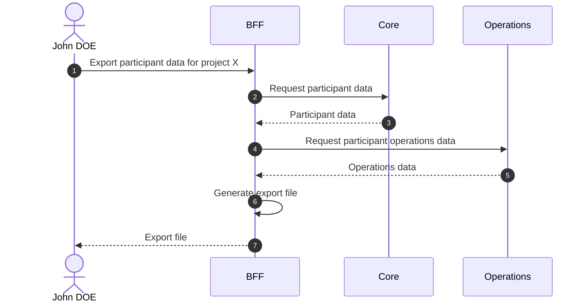

# Export Participant Data

## Objects used

- [Participant](/functional/business-objects/core/participant)

## Allowed roles

- `PROJECT_ADMIN`
- `PROJECT_MANAGER`
- Any user linked to the concerned participant

## Constraints

- Must not include other participants' personal data

Refer to [data policy](/functional/features/data-policy) for the expected format and exported data.

## Workflow

::: info
Access to the project scope is automatically gated by the [authentication profile check](/functional/features/authentication#project-scope-access-check).
:::

